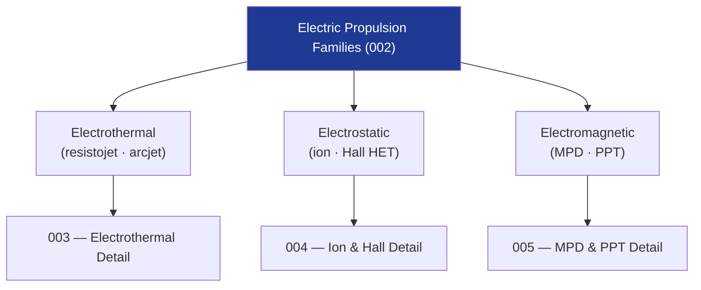

# STA 120-129 · 121-020 — Electric Propulsion Families and Selection Criteria

## 1. Purpose

Defines the **taxonomy of electric propulsion families** and establishes the selection criteria framework for Q+ATLANTIDE STA-band platforms.

## 2. Scope

- **Electrothermal family** — Resistojets (P < 1 kW, Isp 150–300 s), arcjets (P 0.5–30 kW, Isp 500–1 800 s), microwave electrothermal. Selected for low-delta-V attitude maintenance and drag compensation.
- **Electrostatic family** — Gridded ion engines (Isp 2 000–10 000 s, thrust 0.1–250 mN), Hall-effect thrusters (Isp 1 500–3 500 s, thrust 5 mN–1 N). Selected for orbit raising, GEO station-keeping, and interplanetary missions.
- **Electromagnetic family** — Magnetoplasmadynamic (MPD) thrusters (Isp 1 000–8 000 s, thrust up to 200 N applied), pulsed plasma thrusters (PPT, micro-Newton to milli-Newton range). Selected for high-power future missions and precision attitude control.
- **Selection criteria** — Mission ΔV budget, power availability (solar or RTG), propellant mass fraction, Isp target, thruster lifetime, qualification status, plume compatibility.

## 3. Diagram — Electric Propulsion Family Taxonomy

## 4. Footprint

| Metric | Value |
|---|---|
| Subsection | `121` — Propulsión Eléctrica |
| Subsubject | `002` — EP Families and Selection Criteria |
| Primary Q-Division | Q-SPACE[^qdiv] |
| Governance class | `baseline`[^gov] |
| Document | `121-020-Electric-Propulsion-Families-and-Selection-Criteria.md` (this file) |

## 5. References & Citations

[^ecssest35]: **ECSS-E-ST-35C — Propulsion General Requirements**.

[^qdiv]: **Q-Division authority** — See [`organization/Q+ATLANTIDE.md` §4](../../../../organization/Q+ATLANTIDE.md#4-notes).

[^gov]: **Governance class** — `baseline`.

### Applicable industry standards

- ECSS-E-ST-35C — Propulsion General Requirements[^ecssest35]
