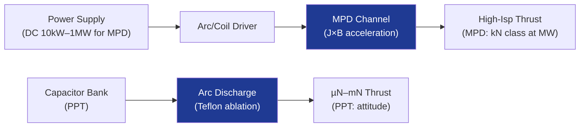

# STA 120-129 · 121-050 — Electromagnetic Propulsion MPDT and Pulsed Plasma

## 1. Purpose

Defines **magnetoplasmadynamic (MPD) thruster and pulsed plasma thruster (PPT)** architectures, performance envelopes, and application boundaries.

## 2. Scope

- **MPD thrusters** — Lorentz force (J × B) accelerates propellant; applied-field MPD (AF-MPD) at low power, self-field MPD at high power (> 100 kW); Isp 1 000–8 000 s; thrust up to 200 N at MW power levels; propellants: Li, Ar, N₂, H₂; heritage: limited flight demonstration (Japan ETS-VI); largely TRL 4–5.
- **Pulsed plasma thrusters (PPT)** — Teflon® propellant ablated and accelerated by capacitor discharge arc; impulse bit 10–200 µNs; average thrust µN–mN; Isp 500–2 500 s; minimal power; heritage: EO-1, Zond-2; attitude control and small satellite applications.
- **Electromagnetic interactions** — EM noise from pulsed/high-current operation; EMC screening required per ECSS-E-ST-20-07C[^ecssemcc]; MPD magnetic field interaction with spacecraft magnetometers.
- **Thermal considerations** — AF-MPD cathode temperature > 3 000 K; radiative heat rejection to spacecraft thermal system; addressed in `009`.
- **Power requirements** — MPD: 10 kW–1 MW DC; PPT: 1–100 W average; capacitor bank sizing for PPT determines mass envelope.

## 3. Diagram — EM Propulsion Architecture

## 4. Footprint

| Metric | Value |
|---|---|
| Subsection | `121` — Propulsión Eléctrica |
| Subsubject | `005` — Electromagnetic Propulsion: MPDT and Pulsed Plasma |
| Primary Q-Division | Q-SPACE[^qdiv] |
| Governance class | `baseline`[^gov] |
| Document | `121-050-Electromagnetic-Propulsion-MPDT-and-Pulsed-Plasma.md` (this file) |

## 5. References & Citations

[^ecssest35]: **ECSS-E-ST-35C — Propulsion General Requirements**.

[^ecssemcc]: **ECSS-E-ST-20-07C — Electromagnetic Compatibility** — EMC requirements for space systems.

[^qdiv]: **Q-Division authority** — See [`organization/Q+ATLANTIDE.md` §4](../../../../organization/Q+ATLANTIDE.md#4-notes).

[^gov]: **Governance class** — `baseline`.

### Applicable industry standards

- ECSS-E-ST-35C — Propulsion General Requirements[^ecssest35]
- ECSS-E-ST-20-07C — Electromagnetic Compatibility[^ecssemcc]
