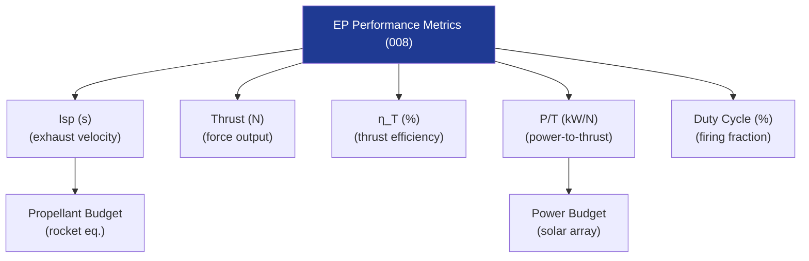

# STA 120-129 · 121-080 — Thrust Isp Efficiency and Duty Cycle Metrics

## 1. Purpose

Defines **performance metrics, efficiency definitions, and duty-cycle constraints** for electric propulsion on Q+ATLANTIDE STA-band platforms.

## 2. Scope

- **Specific impulse (Isp)** — Effective exhaust velocity c* = g₀ × Isp; EP range 500–10 000 s; measured per ECSS-E-ST-35C[^ecssest35] thrust balance testing in vacuum facility (< 10⁻⁴ Pa).
- **Thrust (T)** — T = ṁ × c*; EP thrust range 0.1 µN (FEEP) to ~1 N (high-power HET); measurement uncertainty ≤ 2% (k=2) required for flight calibration.
- **Total impulse (I_t)** — I_t = T × t_firing; mission budget driver; determines propellant mass via rocket equation.
- **Thrust efficiency (η_T)** — η_T = T²/(2 × P_jet × ṁ); combines propellant utilisation (η_m), beam efficiency (η_b), divergence (η_div); total η_T range 50–80% for HET, 65–90% for GIT.
- **Power-to-thrust ratio (P/T)** — kW/mN; lower is better; HET: ~20 kW/N; GIT: ~30–100 kW/N; used for power budget and solar array sizing.
- **Duty cycle** — Firing fraction per orbit/mission; thermal constraint on continuous firing; EP typically 40–80% duty cycle for LEO drag compensation; 100% (continuous) for GEO/interplanetary transfer.

## 3. Diagram — EP Performance Metrics Hierarchy

## 4. Footprint

| Metric | Value |
|---|---|
| Subsection | `121` — Propulsión Eléctrica |
| Subsubject | `008` — Thrust, Isp, Efficiency and Duty-Cycle Metrics |
| Primary Q-Division | Q-SPACE[^qdiv] |
| Governance class | `baseline`[^gov] |
| Document | `121-080-Thrust-Isp-Efficiency-and-Duty-Cycle-Metrics.md` (this file) |

## 5. References & Citations

[^ecssest35]: **ECSS-E-ST-35C — Propulsion General Requirements**.

[^qdiv]: **Q-Division authority** — See [`organization/Q+ATLANTIDE.md` §4](../../../../organization/Q+ATLANTIDE.md#4-notes).

[^gov]: **Governance class** — `baseline`.

### Applicable industry standards

- ECSS-E-ST-35C — Propulsion General Requirements[^ecssest35]
