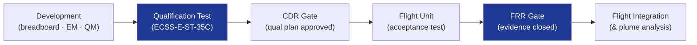

# STA 120-129 · 121-090 — Testing Qualification and Assurance Boundaries

## 1. Purpose

Defines **testing and qualification campaign requirements, and lifecycle assurance boundaries** for electric propulsion on Q+ATLANTIDE STA-band platforms.

## 2. Scope

- **Qualification test levels** — EP subsystems shall be qualified per ECSS-E-ST-35C[^ecssest35] and ECSS-E-ST-10-03C[^ecsstest]:
  - *Acceptance testing* — Each flight unit; functional, performance (Isp, thrust), leak test, proof pressure, EMC screen.
  - *Qualification testing* — Qualification unit (or first flight unit, heritage basis); endurance (≥ mission life × factor), thermal vacuum, vibration/shock, EMC full characterisation.
- **Vacuum facility requirements** — Pressure < 10⁻⁴ Pa during thruster operation; xenon pumping speed ≥ 10 000 l/s; facility neutralisation confirmed (facility plume-free condition verified by witness plates).
- **Performance verification** — Thrust balance calibration traceable to national standard; Isp measurement uncertainty ≤ 2% (k=2); power measurement ±1%.
- **Lifetime assurance** — Endurance test duration ≥ 1 × mission life (heritage design) or ≥ 1.5 × (new design); wear measurement (grid erosion, HET channel erosion) at defined intervals; failure mode catalogue.
- **Assurance gates** — Critical Design Review (CDR) gate: qualification test plan approved; Flight Readiness Review (FRR): qualification evidence package closed.
- **Lifecycle traceability** — All test data, anomaly reports, and waivers archived per ECSS-Q-ST-20C[^ecssqst20c]; traceable to document_id in this registry.

## 3. Diagram — EP Qualification Campaign Flow

## 4. Footprint

| Metric | Value |
|---|---|
| Subsection | `121` — Propulsión Eléctrica |
| Subsubject | `010` — Testing, Qualification and Assurance Boundaries |
| Primary Q-Division | Q-SPACE[^qdiv] |
| Governance class | `baseline`[^gov] |
| Safety boundary | propulsion-critical |
| Document | `121-090-Testing-Qualification-and-Assurance-Boundaries.md` (this file) |

## 5. References & Citations

[^ecssest35]: **ECSS-E-ST-35C — Propulsion General Requirements**.

[^ecsstest]: **ECSS-E-ST-10-03C — Testing** — ECSS standard for space product testing.

[^ecssqst20c]: **ECSS-Q-ST-20C — Quality Assurance** — ECSS quality assurance standard.

[^qdiv]: **Q-Division authority** — See [`organization/Q+ATLANTIDE.md` §4](../../../../organization/Q+ATLANTIDE.md#4-notes).

[^gov]: **Governance class** — `baseline`.

### Applicable industry standards

- ECSS-E-ST-35C — Propulsion General Requirements[^ecssest35]
- ECSS-E-ST-10-03C — Testing[^ecsstest]
- ECSS-Q-ST-20C — Quality Assurance[^ecssqst20c]
