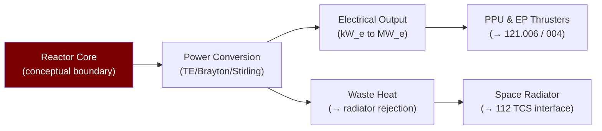

# STA 120-129 · Section 02 · Subsection 122 · Subsubject 005 — Reactor Power Conversion and Thermal Interface Boundaries

## 1. Purpose

Defines **conceptual reactor power conversion system architectures and thermal interface boundaries** for nuclear propulsion systems.

## 2. Scope

- **Conceptual-only boundary** — All content is conceptual-level; no reactor core design, fuel element specifications, or enrichment level data.
- **Power conversion concepts**:
  - *Thermoelectric (TE)* — direct conversion, η ~5–8%; used in RPS; scalable to reactor systems at reduced efficiency.
  - *Thermionic* — electron emission conversion, η ~5–12%; SNAP-10A heritage.
  - *Brayton cycle* — closed-cycle gas turbine, η ~20–35%; 10–1 000 kW_e class; rotating machinery challenge in space.
  - *Stirling cycle* — regenerative reciprocating, η ~25–35%; ASRG concept; scalable to reactor.
- **Thermal rejection interface** — Waste heat rejection via space radiator; radiator area drives spacecraft configuration; conceptual sizing at ~5–20 m²/kW_e rejected.
- **Interface with thruster** — Power conversion electrical output → PPU (STA `121` `006`) → electric thrusters; thermal rejection system interfaced with STA `112_Proteccion-Termica-y-Radiacion`.

## 3. Diagram — Power Conversion Conceptual Chain

## 4. Footprint

| Metric | Value |
|---|---|
| Subsection | `122` — Propulsión Nuclear Conceptual |
| Subsubject | `005` — Reactor Power Conversion and Thermal Interface Boundaries |
| Primary Q-Division | Q-SPACE[^qdiv] |
| Governance class | `baseline`[^gov] |
| Safety boundary | conceptual-only |
| Document | `005_Reactor-Power-Conversion-and-Thermal-Interface-Boundaries.md` (this file) |

## 5. References & Citations

[^iaeatecdoc1819]: **IAEA-TECDOC-1819 — Space Nuclear Power and Propulsion**.

[^qdiv]: **Q-Division authority** — See [`organization/Q+ATLANTIDE.md` §4](../../../../organization/Q+ATLANTIDE.md#4-notes).

[^gov]: **Governance class** — `baseline`.

### Applicable industry standards

- IAEA-TECDOC-1819 — Space Nuclear Power and Propulsion[^iaeatecdoc1819]
- NASA-NSS 1676.1 — Nuclear Safety Policy
