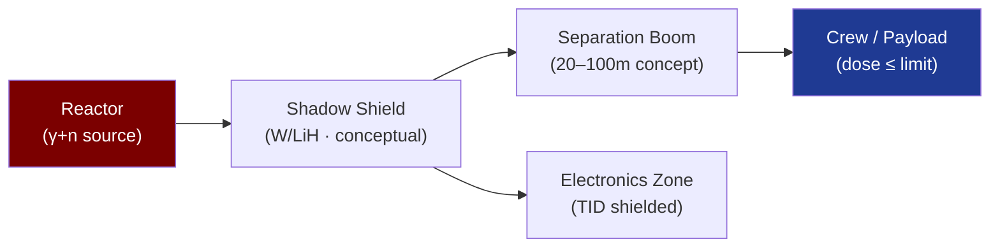

# STA 120-129 · Section 02 · Subsection 122 · Subsubject 006 — Radiation Shielding and Separation Distance Concepts

## 1. Purpose

Defines **conceptual radiation shielding architectures and separation distance principles** for nuclear propulsion systems.

## 2. Scope

- **Conceptual-only boundary** — All content is conceptual-level; no detailed shield design, material activation analysis, or criticality assessment.
- **Shadow shield concept** — Conical or cylindrical shield positioned between reactor and crew/payload compartment; attenuates gamma and neutron flux; shield mass strongly dependent on subtended angle and separation distance.
- **Separation distance principle** — Dose rate D ∝ 1/r²; increasing separation distance is the primary and mass-efficient mitigation strategy for NEP architectures (tethered or extended boom concepts).
- **Crew dose limit reference** — NCRP Report 132 recommends career dose equivalent ≤ 0.25–1.0 Sv depending on age/sex; addressed through combined shield + separation + mission duration budgeting.
- **Material concepts** — Conceptual shield materials: polyethylene (neutron moderation), LiH (neutron absorption), tungsten/lead alloys (gamma attenuation); interface with STA `111_Materiales-Espaciales` and `112_Proteccion-Termica-y-Radiacion`.
- **Electronics dose** — Component TID limits 10–100 krad(Si); addressed via hardened electronics (→ STA `112` payload protection zone).

## 3. Diagram — Shield and Separation Concept

## 4. Footprint

| Metric | Value |
|---|---|
| Subsection | `122` — Propulsión Nuclear Conceptual |
| Subsubject | `006` — Radiation Shielding and Separation Distance Concepts |
| Primary Q-Division | Q-SPACE[^qdiv] |
| Governance class | `baseline`[^gov] |
| Safety boundary | conceptual-only |
| Document | `006_Radiation-Shielding-and-Separation-Distance-Concepts.md` (this file) |

## 5. References & Citations

[^ncrp132]: **NCRP Report No. 132 — Radiation Protection Guidance for Activities in Low-Earth Orbit** — Career dose equivalent limits for space crew.

[^qdiv]: **Q-Division authority** — See [`organization/Q+ATLANTIDE.md` §4](../../../../organization/Q+ATLANTIDE.md#4-notes).

[^gov]: **Governance class** — `baseline`.

### Applicable industry standards

- NCRP Report No. 132 — Radiation Protection Guidance[^ncrp132]
- NASA-STD-3001 Vol. 1 — Crew Health for radiation dose reference
- IAEA-TECDOC-1819 — Space Nuclear Power and Propulsion
