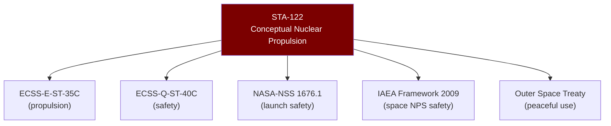

# STA 120-129 · Section 02 · Subsection 122 · Subsubject 009 — ECSS, NASA, IAEA and Outer Space Treaty Mapping

## 1. Purpose

Maps **applicable standards and treaty requirements** for conceptual nuclear propulsion within the Q+ATLANTIDE STA band.

## 2. Scope

| Standard / Treaty | Scope | Relevance to STA-122 |
|---|---|---|
| ECSS-E-ST-35C | Propulsion general requirements | Top-level propulsion standard; applies to nuclear propulsion development |
| ECSS-Q-ST-40C | Safety | Safety analysis and hazard identification for nuclear propulsion |
| NASA-NSS 1676.1 | Nuclear Launch Safety Approval | Launch safety review and NLSA process |
| NASA-STD-8719.14A | Process for Limiting Orbital Debris | Post-mission disposal of nuclear power source |
| IAEA Safety Framework (2009) | Space nuclear power sources | Safety framework for design, test, launch, and operation |
| IAEA-TECDOC-1819 | Space nuclear power and propulsion | Technology overview and safety considerations |
| Outer Space Treaty (1967) | International space law | Art. IV: nuclear weapons prohibition; peaceful use permitted |
| NPT (1970) | Non-Proliferation Treaty | Fissile material safeguards where applicable |
| COPUOS Principles (1992) | UN Principles on NPS in Outer Space | Non-binding principles for safety of nuclear power sources |

- All subsection documents shall comply with the conceptual-only boundary defined in `001` and `008`.

## 3. Diagram — Standards Mapping Tree

## 4. Footprint

| Metric | Value |
|---|---|
| Subsection | `122` — Propulsión Nuclear Conceptual |
| Subsubject | `009` — ECSS, NASA, IAEA and Outer Space Treaty Mapping |
| Primary Q-Division | Q-SPACE[^qdiv] |
| Governance class | `baseline`[^gov] |
| Safety boundary | conceptual-only |
| Document | `009_ECSS-NASA-IAEA-Outer-Space-Treaty-Mapping.md` (this file) |

## 5. References & Citations

[^ecssest35]: **ECSS-E-ST-35C — Propulsion General Requirements**.

[^nasanss16761]: **NASA-NSS 1676.1 — Nuclear Safety Policy**.

[^iaeaspaceNPS]: **IAEA Safety Framework for Nuclear Power Source Applications in Outer Space (2009)**.

[^qdiv]: **Q-Division authority** — See [`organization/Q+ATLANTIDE.md` §4](../../../../organization/Q+ATLANTIDE.md#4-notes).

[^gov]: **Governance class** — `baseline`.

### Applicable industry standards

- ECSS-E-ST-35C[^ecssest35] · ECSS-Q-ST-40C · NASA-NSS 1676.1[^nasanss16761] · IAEA Safety Framework 2009[^iaeaspaceNPS] · Outer Space Treaty (1967) · NPT (1970)
