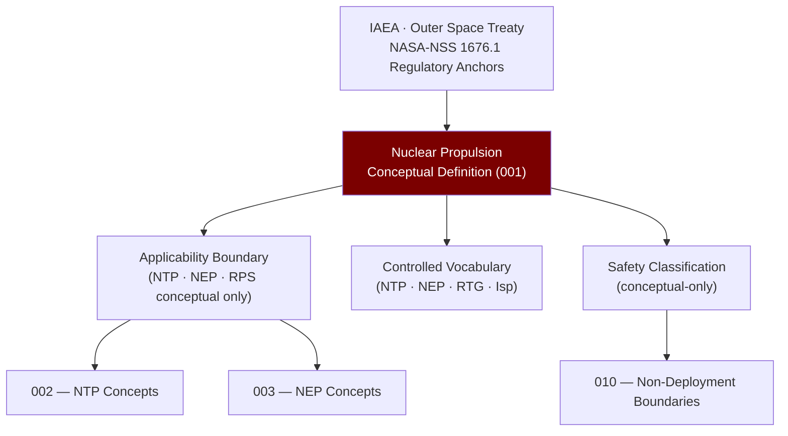

# STA 120-129 · 122-010 — Nuclear Propulsion Conceptual Definition

## 1. Purpose

Establishes the **controlled conceptual scope and non-deployment boundaries** of nuclear propulsion within the Q+ATLANTIDE STA band.

## 2. Scope

- **Controlled definition** — Nuclear propulsion encompasses systems that derive thrust energy from nuclear reactions (fission, radioactive decay, or fusion) to achieve specific impulses typically in the range of 800–100 000 s; within this subsection, all content is **conceptual-level only**.
- **Applicability boundary** — STA `122` covers conceptual-level study of nuclear thermal (NTP), nuclear electric (NEP), and radioisotope propulsion only. It explicitly excludes: reactor design, fissile material handling specifications, launch integration of nuclear payloads, and any operational deployment without separate lawful authority.
- **Controlled vocabulary** — *nuclear thermal propulsion (NTP)*, *nuclear electric propulsion (NEP)*, *radioisotope thermoelectric generator (RTG)*, *specific impulse (Isp)*, *effective exhaust velocity*, *reactor power level*, *shadow shield*, *separation distance*.
- **Safety classification** — conceptual-only; no fissile material handling, reactor operation, or weaponizable technical data without separate lawful authority, safety assurance, IAEA compliance, and Outer Space Treaty adherence.

## 3. Diagram — Nuclear Propulsion Conceptual Definition Framework

## 4. Footprint

| Metric | Value |
|---|---|
| Architecture | `STA` — Space Technology Architecture |
| Subsection | `122` — Propulsión Nuclear Conceptual |
| Subsubject | `001` — Nuclear Propulsion Conceptual Definition |
| Primary Q-Division | Q-SPACE[^qdiv] |
| Governance class | `baseline`[^gov] |
| Safety boundary | conceptual-only |
| Document | `122-010-Nuclear-Propulsion-Conceptual-Definition.md` (this file) |
| Parent subsection | [`README.md`](./README.md) · [`122-000-General.md`](./122-000-General.md) |

## 5. References & Citations

[^nasanss16761]: **NASA-NSS 1676.1 — Nuclear Safety Policy** — NASA nuclear safety policy for space nuclear systems.

[^iaeatecdoc1819]: **IAEA-TECDOC-1819 — Space Nuclear Power and Propulsion** — IAEA overview of space nuclear technologies.

[^qdiv]: **Q-Division authority** — See [`organization/Q+ATLANTIDE.md` §4](../../../../organization/Q+ATLANTIDE.md#4-notes).

[^gov]: **Governance class** — `baseline`.

### Applicable industry standards

- NASA-NSS 1676.1 — Nuclear Safety Policy[^nasanss16761]
- IAEA-TECDOC-1819 — Space Nuclear Power and Propulsion[^iaeatecdoc1819]
- Outer Space Treaty (1967) — Treaty on Principles Governing the Activities of States in the Exploration and Use of Outer Space
