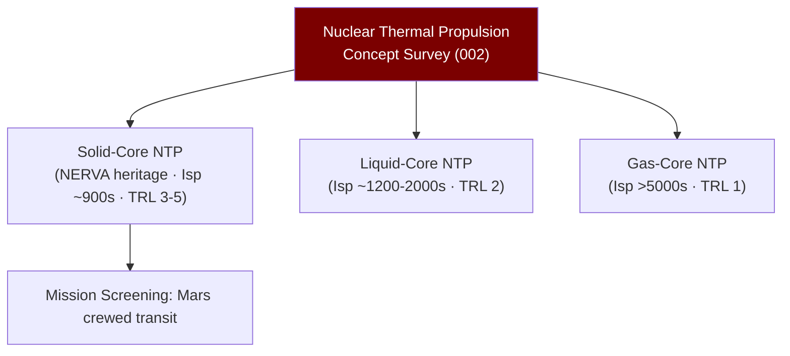

# STA 120-129 · 122-020 — Nuclear Thermal Propulsion Concepts

## 1. Purpose

Surveys **nuclear thermal propulsion (NTP) concepts** at the conceptual level for Q+ATLANTIDE STA-band awareness and mission planning purposes.

## 2. Scope

- **Conceptual-only boundary** — All content is conceptual-level. No reactor design data, fissile material specifications, or operational deployment parameters are included.
- **Solid-core NTP** — Fission reactor heats hydrogen propellant through solid fuel elements (graphite-composite, CERMET); Isp ~800–900 s; historical: NERVA/ROVER programme.
- **Liquid-core NTP** — Fuel in liquid phase allows higher core temperatures; theoretical Isp ~1 200–2 000 s; concept only, TRL 2.
- **Gas-core NTP** — Open/closed-cycle concepts; theoretical Isp > 5 000 s; concept only, TRL 1.
- **Key conceptual parameters** — Thrust-to-weight ratio (NTP: ~5–10× better than chemical for deep space), warm-up/cool-down time, radiation dose accumulation, re-start envelope.
- **Mission relevance** — Conceptual screening for crewed Mars missions, outer planet fast transit; not applicable below TRL 4 threshold without separate programme authority.

## 3. Diagram — NTP Concept Taxonomy

## 4. Footprint

| Metric | Value |
|---|---|
| Subsection | `122` — Propulsión Nuclear Conceptual |
| Subsubject | `002` — Nuclear Thermal Propulsion Concepts |
| Primary Q-Division | Q-SPACE[^qdiv] |
| Governance class | `baseline`[^gov] |
| Safety boundary | conceptual-only |
| Document | `122-020-Nuclear-Thermal-Propulsion-Concepts.md` (this file) |

## 5. References & Citations

[^nasatm103642]: **NASA-TM-103642 — Electric Propulsion Development**.

[^iaeatecdoc1819]: **IAEA-TECDOC-1819 — Space Nuclear Power and Propulsion**.

[^qdiv]: **Q-Division authority** — See [`organization/Q+ATLANTIDE.md` §4](../../../../organization/Q+ATLANTIDE.md#4-notes).

[^gov]: **Governance class** — `baseline`.

### Applicable industry standards

- IAEA-TECDOC-1819 — Space Nuclear Power and Propulsion[^iaeatecdoc1819]
- NASA-NSS 1676.1 — Nuclear Safety Policy
