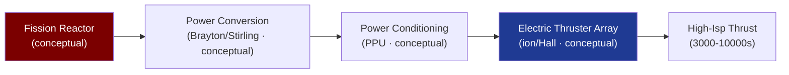

# STA 120-129 · 122-030 — Nuclear Electric Propulsion Concepts

## 1. Purpose

Surveys **nuclear electric propulsion (NEP) concepts** at the conceptual level for Q+ATLANTIDE STA-band mission awareness.

## 2. Scope

- **Conceptual-only boundary** — All content is conceptual-level. No reactor design data, fissile material specifications, or deployment parameters are included.
- **NEP architecture concept** — Fission reactor → power conversion (Brayton/Stirling/thermoelectric) → power conditioning → electric thruster array (ion or Hall). Isp 3 000–10 000 s; thrust 0.1–10 N at MW-class power.
- **Power levels** — Conceptual NEP classes: 100 kW (near-term), 1 MW (mid-term), 10 MW (far-term); each level corresponds to different mission classes (cargo, crewed, outer planets).
- **Key trade-offs** — High Isp/low thrust vs trip-time; reactor mass penalty vs propellant mass savings; radiation shielding mass; thermal rejection radiator area.
- **Interface boundaries** — NEP power chain: reactor → shield → power conversion → PPU → thruster cluster; each interface is a conceptual boundary in this subsection.

## 3. Diagram — NEP Concept Architecture

## 4. Footprint

| Metric | Value |
|---|---|
| Subsection | `122` — Propulsión Nuclear Conceptual |
| Subsubject | `003` — Nuclear Electric Propulsion Concepts |
| Primary Q-Division | Q-SPACE[^qdiv] |
| Governance class | `baseline`[^gov] |
| Safety boundary | conceptual-only |
| Document | `122-030-Nuclear-Electric-Propulsion-Concepts.md` (this file) |

## 5. References & Citations

[^iaeatecdoc1819]: **IAEA-TECDOC-1819 — Space Nuclear Power and Propulsion**.

[^qdiv]: **Q-Division authority** — See [`organization/Q+ATLANTIDE.md` §4](../../../../organization/Q+ATLANTIDE.md#4-notes).

[^gov]: **Governance class** — `baseline`.

### Applicable industry standards

- IAEA-TECDOC-1819 — Space Nuclear Power and Propulsion[^iaeatecdoc1819]
- NASA-NSS 1676.1 — Nuclear Safety Policy
