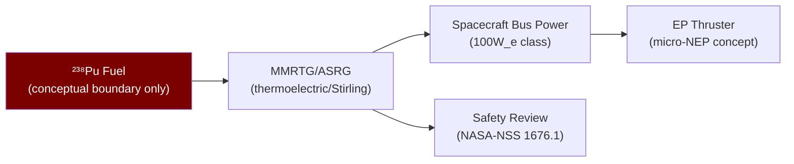

# STA 120-129 · 122-040 — Radioisotope Power and Propulsion Boundaries

## 1. Purpose

Defines the **conceptual boundaries for radioisotope power and propulsion systems** within the Q+ATLANTIDE STA band.

## 2. Scope

- **Conceptual-only boundary** — All content is conceptual-level; no radioisotope material specifications, handling procedures, or launch safety analysis details.
- **RTG / MMRTG power concept** — ²³⁸Pu decay heat converted to electricity via thermoelectric effect; typical: MMRTG ~110 W_e at beginning-of-mission; mission heritage: Cassini, Curiosity, Perseverance; power source for NEP subsystems.
- **ASRG / Stirling concept** — Advanced Stirling Radioisotope Generator; higher efficiency (>4× thermoelectric); reduces Pu-238 inventory requirement; development programme.
- **Propulsion application boundary** — RPS electricity drives electric thrusters (NEP); micro-RPS concepts drive µN-class thrusters; no direct radioisotope thermal propulsion in this subsection (→ `002` NTP for thermally-driven concepts).
- **Safety regulatory boundary** — Launch approval requires nuclear safety review per NASA-NSS 1676.1[^nasanss16761]; environmental impact statement; IAEA safeguards where applicable; Outer Space Treaty compliance.

## 3. Diagram — RPS Power Boundary

## 4. Footprint

| Metric | Value |
|---|---|
| Subsection | `122` — Propulsión Nuclear Conceptual |
| Subsubject | `004` — Radioisotope Power and Propulsion Boundaries |
| Primary Q-Division | Q-SPACE[^qdiv] |
| Governance class | `baseline`[^gov] |
| Safety boundary | conceptual-only |
| Document | `122-040-Radioisotope-Power-and-Propulsion-Boundaries.md` (this file) |

## 5. References & Citations

[^nasanss16761]: **NASA-NSS 1676.1 — Nuclear Safety Policy**.

[^qdiv]: **Q-Division authority** — See [`organization/Q+ATLANTIDE.md` §4](../../../../organization/Q+ATLANTIDE.md#4-notes).

[^gov]: **Governance class** — `baseline`.

### Applicable industry standards

- NASA-NSS 1676.1 — Nuclear Safety Policy[^nasanss16761]
- IAEA Safety Standards — Applicable series for space nuclear power sources
