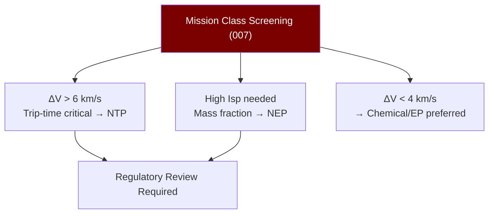

# STA 120-129 · 122-070 — Mission Classes and Use Case Screening

## 1. Purpose

Provides **conceptual mission class taxonomy and use-case screening criteria** for nuclear propulsion consideration within Q+ATLANTIDE STA band.

## 2. Scope

- **Conceptual-only boundary** — Screening tool only; no design authority for nuclear missions without separate programme establishment and regulatory approval.
- **Mission class screening matrix**:

| Mission Class | ΔV Req. | Trip Time Driver | NP Type | Notes |
|---|---|---|---|---|
| Crewed Mars transit | > 6 km/s | < 180 days one-way | NTP (Isp ~900s) | Radiation to crew concern |
| Outer planet cargo | > 10 km/s | Reduce mass fraction | NEP (Isp ~3000s) | Long trip time acceptable |
| Interstellar precursor | > 30 km/s | < 50 years | Advanced NEP/NTP | Pre-TRL 4 |
| High-thrust manoeuvre | > 4 km/s (fast) | Short burn required | NTP | Chemical alternative preferred |

- **Screening criteria** — Mission ΔV budget, trip-time constraint, radiation environment (crew/payload dose), regulatory clearance timeline, alternative propulsion trade (chemical vs NTP vs NEP), power availability.
- **Exclusion criteria** — Earth-orbit missions where chemical/EP is sufficient; missions requiring rapid launch readiness without nuclear review completion.

## 3. Diagram — Mission Class Screening

## 4. Footprint

| Metric | Value |
|---|---|
| Subsection | `122` — Propulsión Nuclear Conceptual |
| Subsubject | `007` — Mission Classes and Use-Case Screening |
| Primary Q-Division | Q-SPACE[^qdiv] |
| Governance class | `baseline`[^gov] |
| Safety boundary | conceptual-only |
| Document | `122-070-Mission-Classes-and-Use-Case-Screening.md` (this file) |

## 5. References & Citations

[^nasanss16761]: **NASA-NSS 1676.1 — Nuclear Safety Policy**.

[^qdiv]: **Q-Division authority** — See [`organization/Q+ATLANTIDE.md` §4](../../../../organization/Q+ATLANTIDE.md#4-notes).

[^gov]: **Governance class** — `baseline`.

### Applicable industry standards

- NASA-NSS 1676.1 — Nuclear Safety Policy[^nasanss16761]
- IAEA-TECDOC-1819 — Space Nuclear Power and Propulsion
