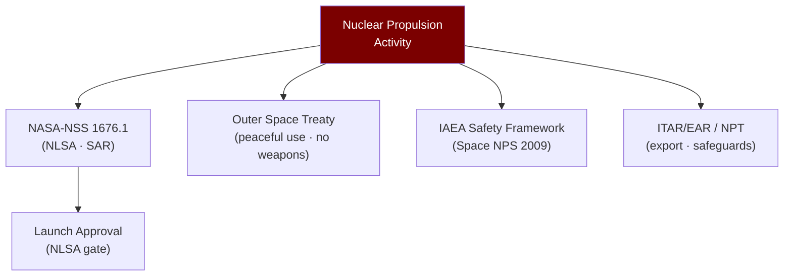

# STA 120-129 · 122-080 — Safety Security and Regulatory Constraints

## 1. Purpose

Defines **safety, security, and regulatory constraint framework** applicable to conceptual nuclear propulsion within Q+ATLANTIDE STA band.

## 2. Scope

- **Conceptual-only boundary** — This subsubject describes regulatory constraints applicable to nuclear propulsion activities. No fissile material handling, weaponizable technical data, or design specifications are provided.
- **Launch safety** — Nuclear launch approval requires Nuclear Launch Safety Approval (NLSA) under NASA-NSS 1676.1[^nasanss16761]; Environmental Impact Statement (EIS) process; safety analysis report (SAR) for radiological consequences of launch accidents.
- **International regulatory framework**:
  - *Outer Space Treaty (1967)* — Article IV: prohibition of nuclear weapons in orbit; nuclear power sources for peaceful purposes permitted under established safety frameworks.
  - *Non-Proliferation Treaty (NPT)* — Safeguards on fissile material applicable to enriched uranium fuel.
  - *IAEA Principles* — Safety Framework for Nuclear Power Source Applications in Outer Space (2009 revision).
- **Export control** — ITAR/EAR compliance required for nuclear-related technology transfer; DoE/NRC licensing for special nuclear material.
- **Security constraints** — Classified information boundary: enrichment levels, criticality parameters, and weapon-relevant technical details are excluded from this and all subsection documents.

## 3. Diagram — Regulatory Constraint Framework

## 4. Footprint

| Metric | Value |
|---|---|
| Subsection | `122` — Propulsión Nuclear Conceptual |
| Subsubject | `008` — Safety, Security and Regulatory Constraints |
| Primary Q-Division | Q-SPACE[^qdiv] |
| Governance class | `baseline`[^gov] |
| Safety boundary | conceptual-only |
| Document | `122-080-Safety-Security-and-Regulatory-Constraints.md` (this file) |

## 5. References & Citations

[^nasanss16761]: **NASA-NSS 1676.1 — Nuclear Safety Policy**.

[^iaeaspaceNPS]: **IAEA Safety Framework for Nuclear Power Source Applications in Outer Space (2009)** — IAEA/COPUOS framework for safe use of nuclear power sources in space.

[^qdiv]: **Q-Division authority** — See [`organization/Q+ATLANTIDE.md` §4](../../../../organization/Q+ATLANTIDE.md#4-notes).

[^gov]: **Governance class** — `baseline`.

### Applicable industry standards

- NASA-NSS 1676.1 — Nuclear Safety Policy[^nasanss16761]
- IAEA Safety Framework for Nuclear Power Source Applications in Outer Space[^iaeaspaceNPS]
- Outer Space Treaty (1967)
- Non-Proliferation Treaty (NPT, 1970)
