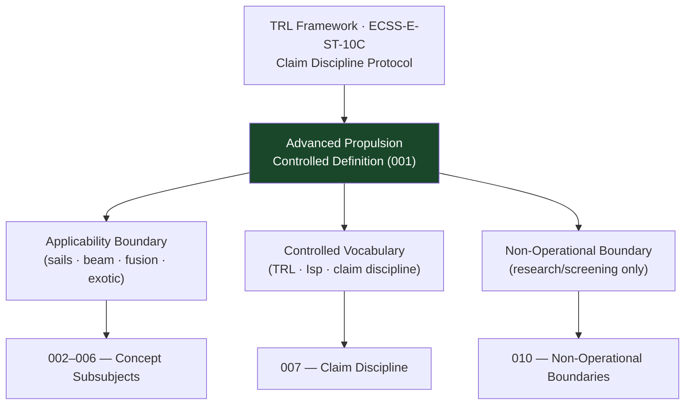

# STA 120-129 · Section 02 · Subsection 123 · Subsubject 001 — Advanced Propulsion Controlled Definition

## 1. Purpose

Establishes the **controlled definition, scope, and non-operational boundaries** for advanced propulsion within the Q+ATLANTIDE STA band.

## 2. Scope

- **Controlled definition** — Advanced propulsion encompasses propulsion concepts beyond conventional chemical, electric, and nuclear systems, typically characterised by Isp > 5 000 s, unconventional energy sources (photon pressure, beam power, plasma interactions), or speculative physics; within this subsection, all content is **research and concept-screening only** unless separately matured, verified, lawfully authorized, and governed through explicit assurance gates.
- **Applicability boundary** — STA `123` covers high-Isp concept surveys, sail propulsion, beam-driven systems, fusion concepts, and exotic propulsion claim discipline; excludes operational systems (→ `120`, `121`), nuclear concepts (→ `122`), and proven electric propulsion (→ `121`).
- **Controlled vocabulary** — *technology readiness level (TRL)*, *photon propulsion*, *solar radiation pressure*, *electric sail*, *beam-driven propulsion*, *fusion propulsion*, *specific impulse (Isp)*, *claim discipline*, *non-operational boundary*.
- **Claim discipline** — Extraordinary propulsion claims shall include: (a) an engineering model, (b) independent verification, and (c) an explicit TRL statement. No claims of proven performance for concepts below TRL 3.

## 3. Diagram — Advanced Propulsion Definition Framework

## 4. Footprint

| Metric | Value |
|---|---|
| Architecture | `STA` — Space Technology Architecture |
| Subsection | `123` — Propulsión Avanzada |
| Subsubject | `001` — Advanced Propulsion Controlled Definition |
| Primary Q-Division | Q-SPACE[^qdiv] |
| Governance class | `baseline`[^gov] |
| Safety boundary | research and concept-screening only |
| Document | `001_Advanced-Propulsion-Controlled-Definition.md` (this file) |
| Parent subsection | [`README.md`](./README.md) · [`000_Overview.md`](./000_Overview.md) |

## 5. References & Citations

[^nasatrl]: **NASA TRL Definitions** — Technology Readiness Level scale TRL 1–9.

[^ecssest10c]: **ECSS-E-ST-10C — System Engineering General Requirements** — TRL assessment framework.

[^qdiv]: **Q-Division authority** — See [`organization/Q+ATLANTIDE.md` §4](../../../../organization/Q+ATLANTIDE.md#4-notes).

[^gov]: **Governance class** — `baseline`.

### Applicable industry standards

- NASA TRL Definitions[^nasatrl]
- ECSS-E-ST-10C — System Engineering General Requirements[^ecssest10c]
