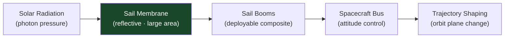

# STA 120-129 · Section 02 · Subsection 123 · Subsubject 003 — Solar Sail and Light-Sail Propulsion

## 1. Purpose

Defines **solar sail and light-sail propulsion** concepts, mechanics, and interface boundaries for Q+ATLANTIDE STA-band awareness.

## 2. Scope

- **Solar radiation pressure principle** — Photon momentum transfer P = F/A = 2G_sc/c (perfect reflector at 1 AU: ~9.1 µN/m²); acceleration depends on sail area-to-mass ratio (lightness number β).
- **Solar sail concept** — Large lightweight reflective membrane (Mylar/polyimide, ≤ 5 µm thick, aluminium-coated); heritage: IKAROS (2010, TRL 5–7), LightSail-2 (2019, TRL 6), NASA Solar Sail Demonstrator.
- **Light sail (beam-driven)** — Laser-propelled concept for interstellar precursors; Breakthrough Starshot concept (TRL 1–2); addressed further in `005`.
- **Key design parameters** — Sail area (10–10 000 m²), areal density (g/m²), deployment mechanism, attitude control (tilt vanes or liquid crystal cells), sail film stress under pressure gradient.
- **Mission classes** — Heliocentric trajectory shaping, near-Sun fast passage, inner solar system surveillance missions, interplanetary cargo for low-mass payloads.
- **Structural interface** — Sail boom loads (buckling-critical thin-wall composite booms), interface with spacecraft bus (STA `110_Estructuras-Orbitales`), thermal environment at perihelion.

## 3. Diagram — Solar Sail Architecture

## 4. Footprint

| Metric | Value |
|---|---|
| Subsection | `123` — Propulsión Avanzada |
| Subsubject | `003` — Solar Sail and Light-Sail Propulsion |
| Primary Q-Division | Q-SPACE[^qdiv] |
| Governance class | `baseline`[^gov] |
| Document | `003_Solar-Sail-and-Light-Sail-Propulsion.md` (this file) |

## 5. References & Citations

[^ikaros]: **JAXA IKAROS Mission (2010)** — First successful solar sail demonstration in interplanetary space.

[^ecssest32c]: **ECSS-E-ST-32C — Structural General Requirements** — Applicable to deployable sail boom structural design.

[^qdiv]: **Q-Division authority** — See [`organization/Q+ATLANTIDE.md` §4](../../../../organization/Q+ATLANTIDE.md#4-notes).

[^gov]: **Governance class** — `baseline`.

### Applicable industry standards

- ECSS-E-ST-32C — Structural General Requirements[^ecssest32c]
