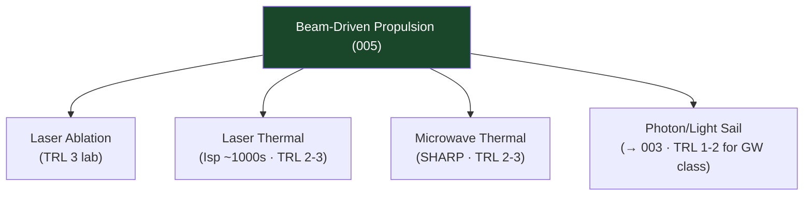

# STA 120-129 · Section 02 · Subsection 123 · Subsubject 005 — Beam-Driven Propulsion Concepts

## 1. Purpose

Surveys **beam-driven propulsion concepts** (laser and microwave) for Q+ATLANTIDE advanced mission awareness, with controlled claim discipline.

## 2. Scope

- **Research and concept-screening only** — No operational systems; requires separate maturation, verification, and authorization.
- **Laser ablation propulsion** — Focused laser beam ablates target material generating thrust; demonstrated at laboratory scale; applications: laser launch (TRL 3), orbit raising (TRL 2); power density limits set by optics aperture and atmospheric propagation.
- **Laser thermal propulsion** — Laser heats propellant (H₂) in thrust chamber; Isp ~800–1 200 s; requires high-power ground or space-based laser; TRL 2–3.
- **Microwave thermal propulsion** — Microwave beam heats propellant; lower beam loss than laser; TRL 2–3; SHARP programme heritage.
- **Photon propulsion (light sail)** — See `003` (solar/light sail); pure photon momentum transfer; extremely low thrust; Breakthrough Starshot: GW-class laser array for g-scale nanocraft; TRL 1–2.
- **Safety and regulatory** — High-power beam weapons dual-use concern; compliance with relevant arms control treaties; safety exclusion zones; claim discipline: all beam power and acceleration claims require verified experimental data.

## 3. Diagram — Beam-Driven Propulsion Taxonomy

## 4. Footprint

| Metric | Value |
|---|---|
| Subsection | `123` — Propulsión Avanzada |
| Subsubject | `005` — Beam-Driven Propulsion Concepts |
| Primary Q-Division | Q-SPACE[^qdiv] |
| Governance class | `baseline`[^gov] |
| Safety boundary | research and concept-screening only |
| Document | `005_Beam-Driven-Propulsion-Concepts.md` (this file) |

## 5. References & Citations

[^nasatrl]: **NASA TRL Definitions** — Technology Readiness Level scale.

[^qdiv]: **Q-Division authority** — See [`organization/Q+ATLANTIDE.md` §4](../../../../organization/Q+ATLANTIDE.md#4-notes).

[^gov]: **Governance class** — `baseline`.

### Applicable industry standards

- NASA TRL Definitions[^nasatrl]
- ECSS-E-ST-10C — System Engineering General Requirements
