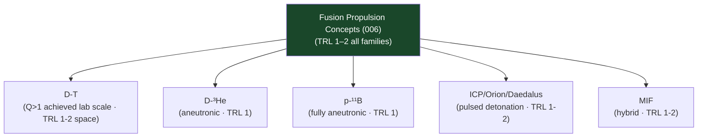

# STA 120-129 · Section 02 · Subsection 123 · Subsubject 006 — Fusion Propulsion Conceptual Boundaries

## 1. Purpose

Defines **conceptual boundaries and TRL screening** for fusion propulsion concepts within Q+ATLANTIDE STA-band advanced propulsion awareness.

## 2. Scope

- **Research and concept-screening only** — No operational fusion propulsion systems exist; TRL 1–3 for all fusion propulsion concepts as of 2025.
- **Fusion propulsion concept families**:
  - *D-T fusion* — Deuterium-tritium; highest gain (Q > 1 achieved in ITER-scale); tritium supply and activation challenge; spacecraft TRL 1–2.
  - *D-³He fusion* — Aneutronic preferred for space; lower shielding mass; higher ignition temperature challenge; TRL 1.
  - *p-¹¹B fusion* — Proton-boron-11; fully aneutronic; highest ignition challenge; TRL 1.
  - *Inertial confinement (ICP)* — Pulsed fusion detonation; Orion/Daedalus concepts; Isp 10 000–1 000 000 s; TRL 1–2.
  - *Magneto-inertial fusion (MIF)* — Hybrid approach (MAGO, FRC); emerging; TRL 1–2.
- **Performance claims discipline** — All Q-value, Isp, and specific power claims shall reference peer-reviewed experimental data and explicit TRL; projections beyond demonstrated plasma conditions are labelled as theoretical estimates only.
- **Interface boundaries** — Fusion propulsion energy/thermal interfaces linked to `009`; no fissile material involvement in aneutronic concepts.

## 3. Diagram — Fusion Propulsion Concept Screening

## 4. Footprint

| Metric | Value |
|---|---|
| Subsection | `123` — Propulsión Avanzada |
| Subsubject | `006` — Fusion Propulsion Conceptual Boundaries |
| Primary Q-Division | Q-SPACE[^qdiv] |
| Governance class | `baseline`[^gov] |
| Safety boundary | research and concept-screening only |
| Document | `006_Fusion-Propulsion-Conceptual-Boundaries.md` (this file) |

## 5. References & Citations

[^nasatrl]: **NASA TRL Definitions** — Technology Readiness Level scale.

[^qdiv]: **Q-Division authority** — See [`organization/Q+ATLANTIDE.md` §4](../../../../organization/Q+ATLANTIDE.md#4-notes).

[^gov]: **Governance class** — `baseline`.

### Applicable industry standards

- NASA TRL Definitions[^nasatrl]
- ECSS-E-ST-10C — System Engineering General Requirements
