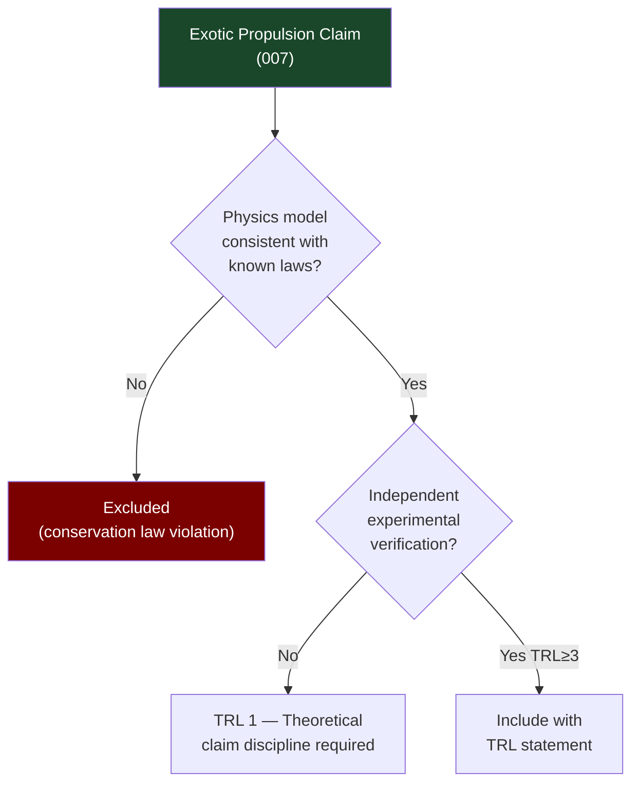

# STA 120-129 · Section 02 · Subsection 123 · Subsubject 007 — Field-Effect and Exotic Propulsion Claim Discipline

## 1. Purpose

Establishes the **claim discipline protocol** for field-effect and exotic propulsion claims within the Q+ATLANTIDE STA band advanced propulsion framework.

## 2. Scope

- **Claim discipline requirement** — Extraordinary propulsion claims shall include: (a) a physics-grounded engineering model, (b) independent experimental verification, and (c) an explicit TRL statement. Claims of performance for concepts below TRL 3 are theoretical estimates only.
- **Excluded claims** — The following concepts have no credible independent verification of anomalous thrust and are excluded from Q+ATLANTIDE advanced propulsion roadmaps pending verified reproduction:
  - *EMDrive / RF resonant cavity thruster* — Multiple independent replications have not confirmed anomalous thrust above measurement artefacts (NASA, TU Dresden, 2021).
  - *Mach effect thruster* — Theoretical basis disputed; no independent confirmation of macroscopic propulsion effect.
  - *Inertial propulsion devices* — Violate conservation of momentum; excluded.
- **Included with claim discipline** — Concepts with theoretical basis and limited (not yet independently replicated) experimental evidence:
  - *Woodward effect (piezoelectric fluctuation)* — Theoretical basis in Mach effect; very low thrust measured; TRL 1–2; independent replication required before ATLAS inclusion.
  - *Photon rocket* — Theoretical; Isp = c/g₀ ≈ 3 × 10⁷ s; requires 100% efficiency radiation source; laser-propelled sails covered in `003`/`005`.
- **Verification protocol** — Independent verification = measurement at ≥ 2 independent facilities, vacuum chamber (< 10⁻⁵ Pa), with calibrated thrust balance (resolution < 1 µN), shielded from thermal/EMC artefacts.

## 3. Diagram — Claim Discipline Decision Tree

## 4. Footprint

| Metric | Value |
|---|---|
| Subsection | `123` — Propulsión Avanzada |
| Subsubject | `007` — Field-Effect and Exotic Propulsion Claim Discipline |
| Primary Q-Division | Q-SPACE[^qdiv] |
| Governance class | `baseline`[^gov] |
| Safety boundary | research and concept-screening only |
| Document | `007_Field-Effect-and-Exotic-Propulsion-Claim-Discipline.md` (this file) |

## 5. References & Citations

[^nasatrl]: **NASA TRL Definitions** — Technology Readiness Level scale.

[^qdiv]: **Q-Division authority** — See [`organization/Q+ATLANTIDE.md` §4](../../../../organization/Q+ATLANTIDE.md#4-notes).

[^gov]: **Governance class** — `baseline`.

### Applicable industry standards

- NASA TRL Definitions[^nasatrl]
- ECSS-E-ST-10C — System Engineering General Requirements
