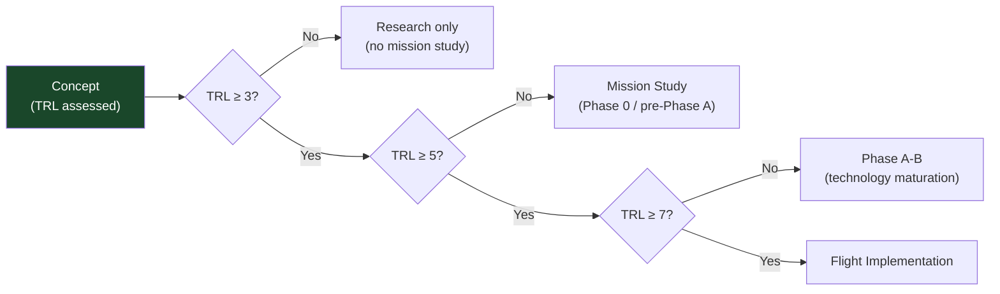

# STA 120-129 · Section 02 · Subsection 123 · Subsubject 008 — Mission Use-Cases and Technology Readiness Screening

## 1. Purpose

Provides **mission use-case taxonomy and TRL-based screening** for advanced propulsion concepts within Q+ATLANTIDE STA-band planning.

## 2. Scope

| Concept | TRL (2025) | Mission Use-Case | Time Horizon |
|---|---|---|---|
| Solar sail | 5–6 | Heliocentric trajectory shaping, near-Sun probes | 2025–2035 |
| E-sail | 3–4 | Outer solar system, heliosphere exit | 2030–2045 |
| Laser ablation (launch) | 3 | Small payload launch assist | 2030+ |
| Laser thermal (in-space) | 2–3 | Fast transit, orbit raising | 2035+ |
| Fusion (D-³He) | 1–2 | Crewed interplanetary, outer solar system | 2050+ |
| Antimatter (conceptual) | 1 | Interstellar precursor | > 2070 |

- **Screening criteria** — TRL ≥ 3 for mission study inclusion; TRL ≥ 5 for Phase-A system design; TRL ≥ 7 for flight implementation; extraordinary claims require TRL verification per `007`.
- **Mission class match** — Each concept screened against mission ΔV, power availability, trip-time constraint, regulatory clearance, and spacecraft mass budget.
- **Non-operational boundary** — Concepts below TRL 4 are classified as research topics; no operational mission commitments without separate technology maturation programme.

## 3. Diagram — TRL Screening Gate

## 4. Footprint

| Metric | Value |
|---|---|
| Subsection | `123` — Propulsión Avanzada |
| Subsubject | `008` — Mission Use-Cases and Technology Readiness Screening |
| Primary Q-Division | Q-SPACE[^qdiv] |
| Governance class | `baseline`[^gov] |
| Safety boundary | research and concept-screening only |
| Document | `008_Mission-Use-Cases-and-Technology-Readiness-Screening.md` (this file) |

## 5. References & Citations

[^nasatrl]: **NASA TRL Definitions** — Technology Readiness Level scale.

[^ecssest10c]: **ECSS-E-ST-10C — System Engineering General Requirements**.

[^qdiv]: **Q-Division authority** — See [`organization/Q+ATLANTIDE.md` §4](../../../../organization/Q+ATLANTIDE.md#4-notes).

[^gov]: **Governance class** — `baseline`.

### Applicable industry standards

- NASA TRL Definitions[^nasatrl]
- ECSS-E-ST-10C — System Engineering General Requirements[^ecssest10c]
