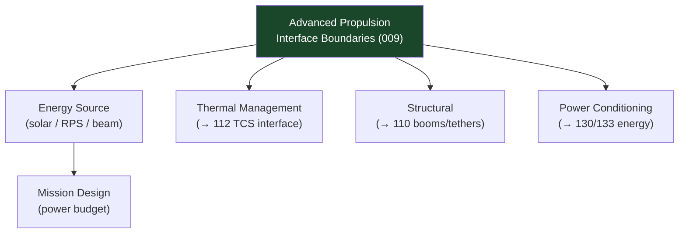

# STA 120-129 · Section 02 · Subsection 123 · Subsubject 009 — Energy, Thermal and Structural Interface Boundaries

## 1. Purpose

Defines **energy source, thermal management, and structural interface boundaries** for advanced propulsion integration on Q+ATLANTIDE STA-band platforms.

## 2. Scope

- **Energy source interfaces**:
  - *Solar sail* — No onboard energy source needed for thrust; attitude control relies on spacecraft power (typically ≤ 500 W for active vane control or ADCS).
  - *E-sail* — Electron gun: 0.5–5 kW; spacecraft solar array or RPS interface.
  - *Laser thermal* — Ground/space-based beam receiver; onboard power mainly for thermal management and ADCS.
  - *Fusion (conceptual)* — Power source: self-sustaining fusion burn (conceptual); interface with power conditioning yet undefined below TRL 3.
- **Thermal management boundaries**:
  - High-heat-flux sources (laser absorber, beam receiver) require radiator area ≥ 10 m²/kW absorbed; interface with `112_Proteccion-Termica-y-Radiacion`.
  - Solar sail perihelion environment: 1 000–3 500 W/m² solar flux; sail material thermal degradation addressed in `111_Materiales-Espaciales`.
- **Structural interfaces**:
  - Deployable sail booms: launch load envelope, deployment mechanism heritage; interface with `110_Estructuras-Orbitales`.
  - Tether systems (E-sail): tether tension during deployment; failure modes (conductive tether micrometeorite cutting); interface with `110`.
  - High-power antenna/beam receiver: vibration isolation from thruster plume-induced perturbations.
- **Assurance gates** — Each advanced propulsion concept integration shall pass energy/thermal/structural interface assurance review before Phase-B commitment.

## 3. Diagram — Interface Boundaries

## 4. Footprint

| Metric | Value |
|---|---|
| Subsection | `123` — Propulsión Avanzada |
| Subsubject | `009` — Energy, Thermal and Structural Interface Boundaries |
| Primary Q-Division | Q-SPACE[^qdiv] |
| Governance class | `baseline`[^gov] |
| Safety boundary | research and concept-screening only |
| Document | `009_Energy-Thermal-and-Structural-Interface-Boundaries.md` (this file) |

## 5. References & Citations

[^ecssest31c]: **ECSS-E-ST-31C — Thermal Control General Requirements**.

[^ecssest32c]: **ECSS-E-ST-32C — Structural General Requirements**.

[^qdiv]: **Q-Division authority** — See [`organization/Q+ATLANTIDE.md` §4](../../../../organization/Q+ATLANTIDE.md#4-notes).

[^gov]: **Governance class** — `baseline`.

### Applicable industry standards

- ECSS-E-ST-31C — Thermal Control General Requirements[^ecssest31c]
- ECSS-E-ST-32C — Structural General Requirements[^ecssest32c]
- ECSS-E-ST-10C — System Engineering General Requirements
