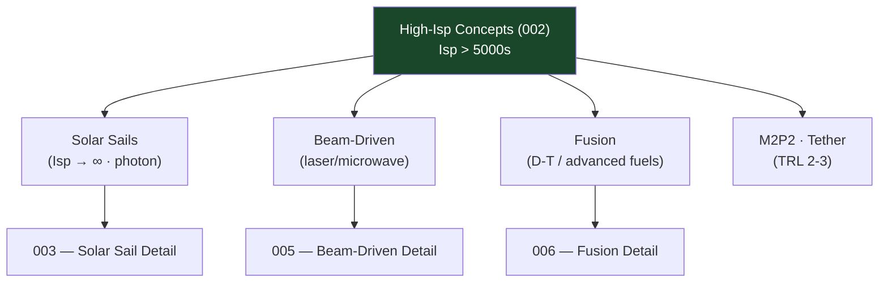

# STA 120-129 · 123-020 — High Isp Propulsion Concepts

## 1. Purpose

Surveys **high-Isp propulsion concepts** (Isp > 5 000 s) relevant to Q+ATLANTIDE advanced mission screening and long-term roadmap awareness.

## 2. Scope

- **Scope boundary** — Research and concept-screening only; no operational commitments for concepts below TRL 4.
- **High-Isp taxonomy** — Concepts achieving specific impulses substantially above conventional electric propulsion (> 5 000 s):
  - *Solar sails* — Photon pressure Isp effectively infinite; addressed in `003`.
  - *Beam-driven propulsion* — Laser/microwave beamed energy; addressed in `005`.
  - *Fusion propulsion* — D-T or advanced fuel cycles; Isp 10 000–1 000 000 s; addressed in `006`.
  - *Mini-magnetospheric plasma propulsion (M2P2)* — TRL 2–3 concept.
  - *Momentum exchange tethers* — Orbital mechanics, not propellant-based.
- **Screening criteria** — TRL ≥ 2, peer-reviewed performance data, energy source availability at proposed power level, structural envelope compatibility.
- **Mission relevance** — Interstellar precursor missions, outer solar system fast transit, near-relativistic probes (conceptual planning horizon > 2050).

## 3. Diagram — High-Isp Concept Survey

## 4. Footprint

| Metric | Value |
|---|---|
| Subsection | `123` — Propulsión Avanzada |
| Subsubject | `002` — High-Isp Propulsion Concepts |
| Primary Q-Division | Q-SPACE[^qdiv] |
| Governance class | `baseline`[^gov] |
| Safety boundary | research and concept-screening only |
| Document | `123-020-High-Isp-Propulsion-Concepts.md` (this file) |

## 5. References & Citations

[^nasatrl]: **NASA TRL Definitions** — Technology Readiness Level scale.

[^qdiv]: **Q-Division authority** — See [`organization/Q+ATLANTIDE.md` §4](../../../../organization/Q+ATLANTIDE.md#4-notes).

[^gov]: **Governance class** — `baseline`.

### Applicable industry standards

- NASA TRL Definitions[^nasatrl]
- ECSS-E-ST-10C — System Engineering General Requirements
