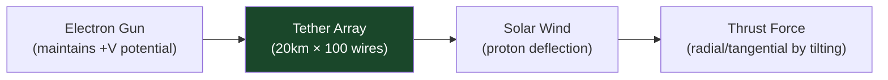

# STA 120-129 · 123-040 — Electric Sail and Plasma Sail Concepts

## 1. Purpose

Surveys **electric sail (E-sail) and plasma sail propulsion concepts** for Q+ATLANTIDE advanced mission awareness.

## 2. Scope

- **Research and concept-screening only** — No operational systems below TRL 4.
- **Electric sail (E-sail)** — Finnish invention (Janhunen 2004); positively charged thin-wire tethers (~20 km long, 100+ wires) repel solar wind protons generating thrust; predicted acceleration ~1 mm/s² at 1 AU; TRL 3–4 (ESTCube-1 partial test 2013); thrust direction control by modulating tether voltages.
- **Plasma brake** — Negatively charged tether variant for deceleration / deorbit; TRL 4–5 demonstrated; ESTCube-2, FORESAIL-1 missions.
- **Magnetic sail (M-sail)** — Superconducting coil generates magnetic bubble to deflect solar wind; theoretical performance; TRL 1–2.
- **Mini-magnetospheric plasma propulsion (M2P2)** — Injection of plasma inflates artificial magnetosphere; TRL 2; high power requirement.
- **Key uncertainties** — E-sail wire deployment reliability, tether–tether collision avoidance at scale, electron gun mass budget, interaction with interplanetary magnetic field at high heliocentric latitudes.

## 3. Diagram — E-Sail Concept

## 4. Footprint

| Metric | Value |
|---|---|
| Subsection | `123` — Propulsión Avanzada |
| Subsubject | `004` — Electric Sail and Plasma Sail Concepts |
| Primary Q-Division | Q-SPACE[^qdiv] |
| Governance class | `baseline`[^gov] |
| Safety boundary | research and concept-screening only |
| Document | `123-040-Electric-Sail-and-Plasma-Sail-Concepts.md` (this file) |

## 5. References & Citations

[^janhunen2004]: **Janhunen P. (2004) — Electric Sail for Spacecraft Propulsion** — Journal of Propulsion and Power, original E-sail concept paper.

[^qdiv]: **Q-Division authority** — See [`organization/Q+ATLANTIDE.md` §4](../../../../organization/Q+ATLANTIDE.md#4-notes).

[^gov]: **Governance class** — `baseline`.

### Applicable industry standards

- NASA TRL Definitions — Technology Readiness Level scale
- ECSS-E-ST-10C — System Engineering General Requirements
