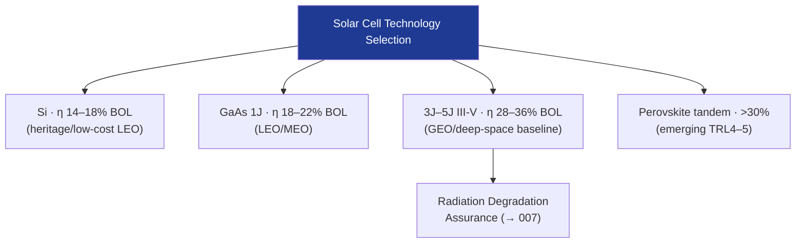

# STA 130-139 · Section 03 · Subsection 130 · Subsubject 003 — Solar Cell Technologies and Efficiency Classes

## 1. Purpose

Establishes the **taxonomy of solar cell technologies** and their AM0 efficiency classes applicable to Q+ATLANTIDE STA-band space platforms.

## 2. Scope

- **Silicon (Si)** — 1st-generation; η ≈ 14–18% BOL; radiation-sensitive; used in heritage small-sat and low-cost LEO missions.
- **Gallium Arsenide (GaAs) single-junction** — η ≈ 18–22% BOL; improved radiation resistance; baseline for many LEO/MEO applications.
- **Multi-junction III-V (GaInP/GaAs/Ge)** — state-of-the-practice; η ≈ 28–32% BOL (3J); η ≈ 33–36% (4J/5J inverted metamorphic); dominant for GEO and deep-space missions.
- **Perovskite tandem (emerging)** — η >30% potential; degradation under proton fluence under assessment; TRL 4–5 for space application.
- **Cell qualification** — per ECSS-E-ST-20-08C; radiation assurance per proton/electron equivalence fluence testing; minimum mean degradation factors (MDFs) required in power budget.

## 3. Diagram — Cell Technology Hierarchy

## 4. Footprint

| Metric | Value |
|---|---|
| Subsection | `130` — Energía Solar |
| Subsubject | `003` — Solar Cell Technologies and Efficiency Classes |
| Primary Q-Division | Q-SPACE[^qdiv] |
| Governance class | `baseline`[^gov] |

## 5. References & Citations

[^ecssest2008c]: **ECSS-E-ST-20-08C — Photovoltaic Assemblies and Components**.
[^qdiv]: **Q-Division authority** — See [`organization/Q+ATLANTIDE.md` §4](../../../../organization/Q+ATLANTIDE.md#4-notes).
[^gov]: **Governance class** — `baseline`.

### Applicable industry standards
- ECSS-E-ST-20-08C — Space Engineering: Photovoltaic Assemblies and Components[^ecssest2008c]
- NASA-RP-1345 — Handbook of Recommended Practices for the Design of High-Voltage Power Systems
