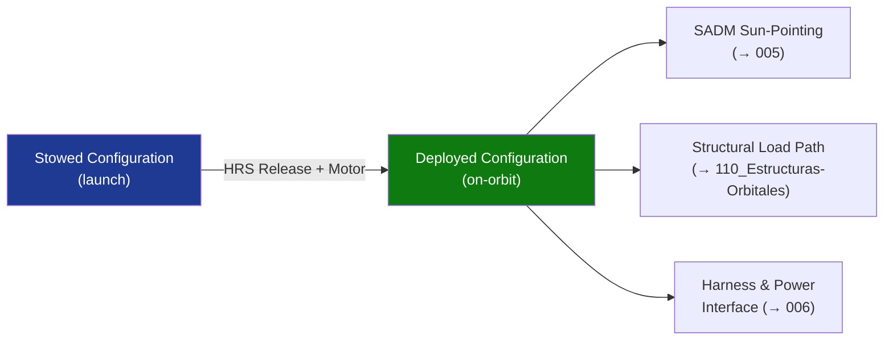

# STA 130-139 · Section 03 · Subsection 130 · Subsubject 004 — Deployable Panels, Wings and Structural Interfaces

## 1. Purpose

Defines **structural interfaces and deployment mechanisms** for solar array wings and panels within Q+ATLANTIDE STA-band platforms.

## 2. Scope

- **Deployment mechanisms** — hinge/latch, motor-driven yoke, torsion springs, NEA (non-explosive actuator) release; deployment sequence and hold-down/release system (HRS).
- **Structural load cases** — launch vibration and acoustic loads (per ECSS-E-ST-32C[^ecssest32c]); on-orbit thermal distortion; dynamic coupling with attitude control (→ `005`).
- **Panel substrate** — aluminium honeycomb / CFRP facesheet; thermal expansion matched to cell substrate; mass and stiffness trade.
- **SADM interface** — solar array drive mechanism mounting; slip-ring harness routing; torque and pointing accuracy allocation.
- **Deployment reliability** — dual-redundant release; separation testing; deployment shock levels to spacecraft interface ≤ SRS limit.

## 3. Diagram — Deployment and Structural Interface

## 4. Footprint

| Metric | Value |
|---|---|
| Subsection | `130` — Energía Solar |
| Subsubject | `004` — Deployable Panels, Wings and Structural Interfaces |
| Primary Q-Division | Q-SPACE[^qdiv] |
| Governance class | `baseline`[^gov] |

## 5. References & Citations

[^ecssest32c]: **ECSS-E-ST-32C — Space Engineering: Structural General Requirements**.
[^qdiv]: **Q-Division authority** — See [`organization/Q+ATLANTIDE.md` §4](../../../../organization/Q+ATLANTIDE.md#4-notes).
[^gov]: **Governance class** — `baseline`.

### Applicable industry standards
- ECSS-E-ST-32C — Structural General Requirements[^ecssest32c]
- ECSS-E-ST-20-08C — Photovoltaic Assemblies and Components
