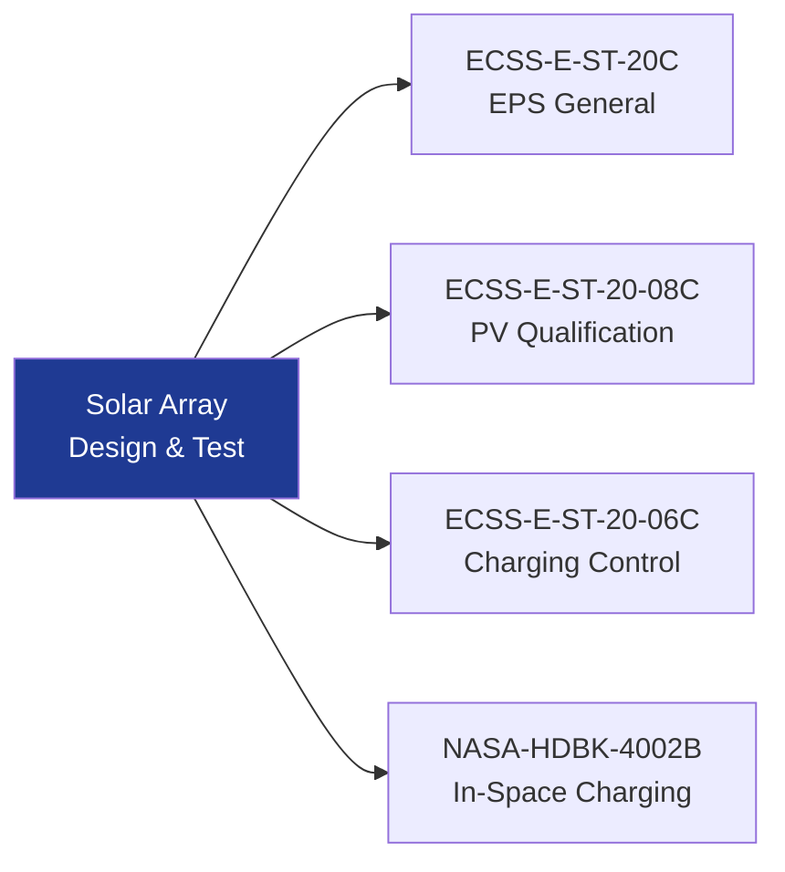

# STA 130-139 · Section 03 · Subsection 130 · Subsubject 009 — ECSS-NASA Solar Power Standards Mapping

## 1. Purpose

Maps applicable **ECSS and NASA solar power standards** to Q+ATLANTIDE STA-band subsection `130` design, qualification, and verification activities.

## 2. Scope

| Standard | Scope | Applicability |
|---|---|---|
| ECSS-E-ST-20C | Electrical and Electronic — EPS general requirements | Design, IVV |
| ECSS-E-ST-20-08C | Photovoltaic assemblies and components | Cell/array qualification |
| ECSS-E-ST-20-06C | Spacecraft charging — design and verification | Array surface charging |
| NASA-HDBK-4002B | Mitigating in-space charging effects | Charging control |
| NASA-RP-1345 | Handbook for high-voltage EPS design | HV array design |
| MIL-STD-461G | EMC requirements (government reference) | Array EMC |

## 3. Diagram — Standards Traceability

## 4. Footprint

| Metric | Value |
|---|---|
| Subsection | `130` — Energía Solar |
| Subsubject | `009` — ECSS-NASA Solar Power Standards Mapping |
| Primary Q-Division | Q-SPACE[^qdiv] |
| Governance class | `baseline`[^gov] |

## 5. References & Citations

[^ecssest20]: **ECSS-E-ST-20C** — Electrical and Electronic.
[^ecssest2008c]: **ECSS-E-ST-20-08C** — Photovoltaic Assemblies and Components.
[^qdiv]: **Q-Division authority** — See [`organization/Q+ATLANTIDE.md` §4](../../../../organization/Q+ATLANTIDE.md#4-notes).
[^gov]: **Governance class** — `baseline`.

### Applicable industry standards
- ECSS-E-ST-20C[^ecssest20]
- ECSS-E-ST-20-08C[^ecssest2008c]
- NASA-HDBK-4002B
