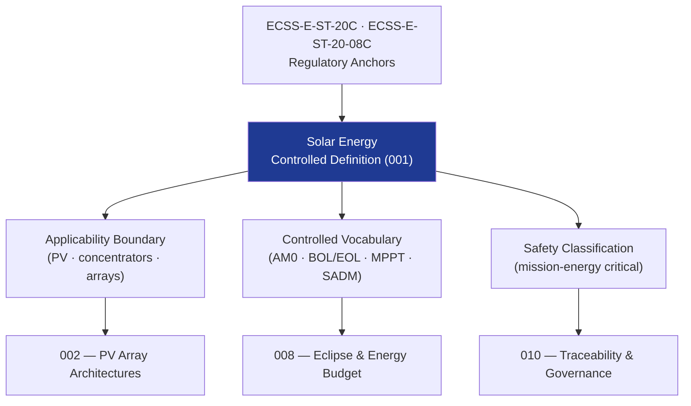

# STA 130-139 · 130-010 — Solar Energy Controlled Definition

## 1. Purpose

Establishes the **normative definition and controlled scope** of solar energy within the Q+ATLANTIDE STA band, per ECSS-E-ST-20C[^ecssest20].

## 2. Scope

- **Controlled definition** — Solar energy systems convert incident solar radiation into electrical power via photovoltaic conversion or thermal processes to supply all electrical loads aboard Q+ATLANTIDE space platforms throughout their operational lifetime.
- **Applicability boundary** — STA `130` covers photovoltaic solar arrays and concentrator systems on Q+ATLANTIDE STA-band platforms; excludes chemical energy storage (→ `131`), nuclear power (→ `132`), and electrical distribution (→ `133`).
- **Controlled vocabulary** — *solar constant (S₀ = 1361 W/m²)*, *AM0 spectrum*, *beginning-of-life (BOL)*, *end-of-life (EOL)*, *power generation efficiency (η)*, *solar array drive mechanism (SADM)*, *maximum power point tracking (MPPT)*, *photovoltaic (PV) cell*, *array specific power (W/kg)*.
- **Safety classification** — mission-energy critical; solar array deployment failures or power shortfalls may result in mission loss.

## 3. Diagram — Solar Energy Definition Framework

## 4. Footprint

| Metric | Value |
|---|---|
| Architecture | `STA` — Space Technology Architecture |
| Subsection | `130` — Energía Solar |
| Subsubject | `001` — Solar Energy Controlled Definition |
| Primary Q-Division | Q-SPACE[^qdiv] |
| Governance class | `baseline`[^gov] |
| Document | `130-010-Solar-Energy-Controlled-Definition.md` (this file) |
| Parent subsection | [`README.md`](./README.md) · [`130-000-General.md`](./130-000-General.md) |

## 5. References & Citations

[^ecssest20]: **ECSS-E-ST-20C — Electrical and Electronic** — European standard for spacecraft electrical power subsystems.

[^ecssest2008c]: **ECSS-E-ST-20-08C — Space Engineering: Photovoltaic Assemblies and Components** — European standard for PV components qualification and test.

[^qdiv]: **Q-Division authority** — See [`organization/Q+ATLANTIDE.md` §4](../../../../organization/Q+ATLANTIDE.md#4-notes).

[^gov]: **Governance class** — `baseline`.

### Applicable industry standards

- ECSS-E-ST-20C — Electrical and Electronic[^ecssest20]
- ECSS-E-ST-20-08C — Space Engineering: Photovoltaic Assemblies and Components[^ecssest2008c]
