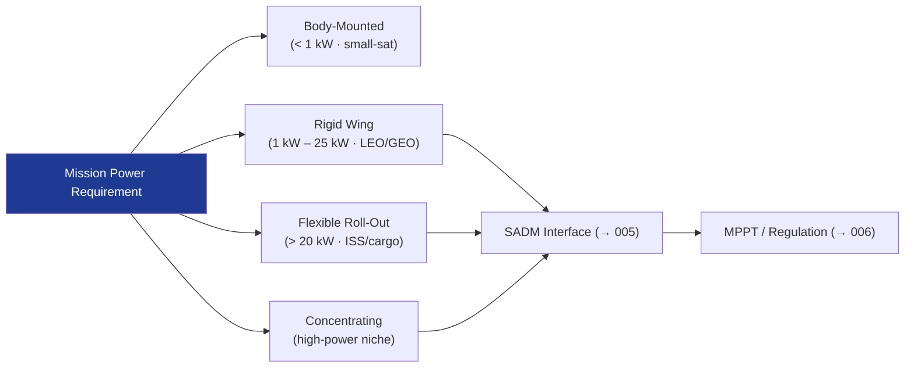

# STA 130-139 · 130-020 — Photovoltaic Array Architectures

## 1. Purpose

Defines **photovoltaic array architecture options** for Q+ATLANTIDE STA-band platforms covering body-mounted, rigid-panel wing, flexible roll-out, and concentrating solar array configurations.

## 2. Scope

- **Body-mounted arrays** — fixed panels bonded to spacecraft structure; no deployment mechanism; limited area; used for small satellites and attitude-independent margins.
- **Rigid deployable wings** — symmetric wing configurations with yoke and hinge deployment; dominant for LEO/GEO/deep-space platforms >1 kW.
- **Flexible roll-out arrays (ROSA, SOLAROSA)** — high specific power (>150 W/kg BOL); reduced stowage volume; deployed via motor/spring mechanisms.
- **Concentrating solar arrays** — Fresnel/reflector concentration; highest efficiency; thermal management challenges; used for high-power GEO and nuclear-electric alternatives.
- **String/section topology** — series-parallel cell strings, bypass diodes, blocking diodes; array output voltage regulation interfaces with MPPT (→ `006`).

## 3. Diagram — PV Array Architecture Selection

## 4. Footprint

| Metric | Value |
|---|---|
| Subsection | `130` — Energía Solar |
| Subsubject | `002` — Photovoltaic Array Architectures |
| Primary Q-Division | Q-SPACE[^qdiv] |
| Governance class | `baseline`[^gov] |
| Document | `130-020-Photovoltaic-Array-Architectures.md` |

## 5. References & Citations

[^ecssest20]: **ECSS-E-ST-20C — Electrical and Electronic**.
[^qdiv]: **Q-Division authority** — See [`organization/Q+ATLANTIDE.md` §4](../../../../organization/Q+ATLANTIDE.md#4-notes).
[^gov]: **Governance class** — `baseline`.

### Applicable industry standards
- ECSS-E-ST-20C — Electrical and Electronic[^ecssest20]
- ECSS-E-ST-20-08C — Space Engineering: Photovoltaic Assemblies and Components
