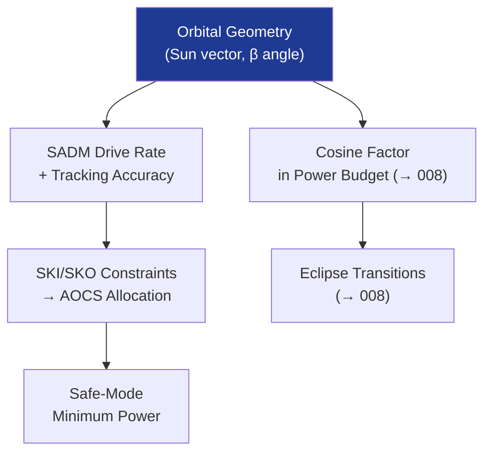

# STA 130-139 · 130-050 — Sun Pointing Tracking and Attitude Constraints

## 1. Purpose

Establishes **sun-pointing, SADM tracking and attitude constraint requirements** for solar arrays on Q+ATLANTIDE STA-band platforms.

## 2. Scope

- **SADM tracking** — 1-axis rotation about yoke axis; tracking accuracy ≤ ±2° for multi-junction cells (cosine-loss ≤ 0.06%); drive rate and duty cycle allocation.
- **Solar incidence angle** — cosine factor (P = P₀·cos θ); mispointing allocation in power budget; worst-case attitude scenarios.
- **Attitude constraints** — sun-keep-in (SKI) and sun-keep-out (SKO) zones for payload/star tracker exclusion; solar array slew rate limits imposed on attitude control.
- **Sunrise/sunset transitions** — array current surges; inrush current limiting; MPPT transient management.
- **Tumbling/safe-mode** — minimum power generation in safe mode (spinning or gravity-gradient stabilised); battery discharge margins.

## 3. Diagram — Sun-Pointing and Attitude Interface

## 4. Footprint

| Metric | Value |
|---|---|
| Subsection | `130` — Energía Solar |
| Subsubject | `005` — Sun-Pointing, Tracking and Attitude Constraints |
| Primary Q-Division | Q-SPACE[^qdiv] |
| Governance class | `baseline`[^gov] |

## 5. References & Citations

[^ecssest20]: **ECSS-E-ST-20C — Electrical and Electronic**.
[^qdiv]: **Q-Division authority** — See [`organization/Q+ATLANTIDE.md` §4](../../../../organization/Q+ATLANTIDE.md#4-notes).
[^gov]: **Governance class** — `baseline`.

### Applicable industry standards
- ECSS-E-ST-20C — Electrical and Electronic[^ecssest20]
