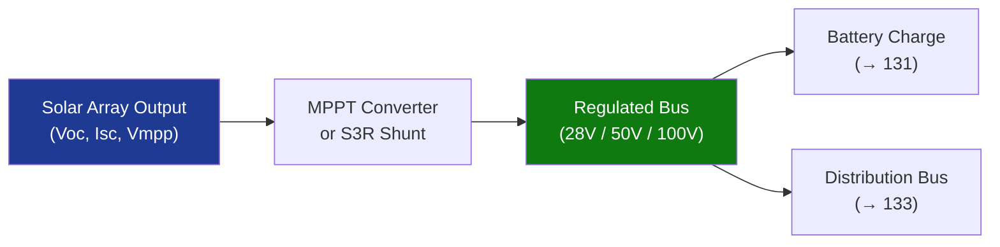

# STA 130-139 · 130-060 — Power Conversion Regulation and MPPT

## 1. Purpose

Defines **power conversion, bus voltage regulation and maximum power point tracking (MPPT)** interfaces for solar arrays on Q+ATLANTIDE STA-band platforms.

## 2. Scope

- **S3R (Sequential Switching Shunt Regulator)** — shunt regulation; fixed bus voltage; standard for GEO; low EMI; high efficiency.
- **MPPT converters** — perturb-and-observe, incremental conductance, or model-based algorithms; maximises power harvest under partial illumination and temperature variation; preferred for LEO with frequent eclipse transitions.
- **Bus voltage standards** — 28 V regulated (small platforms); 50 V / 100 V unregulated or regulated (medium); 120 V / 160 V (large/ISS-class).
- **Efficiency allocation** — array-to-bus efficiency ≥ 90%; converter thermal dissipation to thermal budget (→ `112_Proteccion-Termica-y-Radiacion`).
- **Interfaces** — array output voltage range → MPPT/shunt input; regulated bus → battery charge controller (→ `131`); distribution harness (→ `133`).

## 3. Diagram — Power Conversion Chain

## 4. Footprint

| Metric | Value |
|---|---|
| Subsection | `130` — Energía Solar |
| Subsubject | `006` — Power Conversion, Regulation and MPPT |
| Primary Q-Division | Q-SPACE[^qdiv] |
| Governance class | `baseline`[^gov] |

## 5. References & Citations

[^ecssest20]: **ECSS-E-ST-20C — Electrical and Electronic**.
[^qdiv]: **Q-Division authority** — See [`organization/Q+ATLANTIDE.md` §4](../../../../organization/Q+ATLANTIDE.md#4-notes).
[^gov]: **Governance class** — `baseline`.

### Applicable industry standards
- ECSS-E-ST-20C — Electrical and Electronic[^ecssest20]
- ECSS-E-ST-20-08C — Photovoltaic Assemblies and Components
