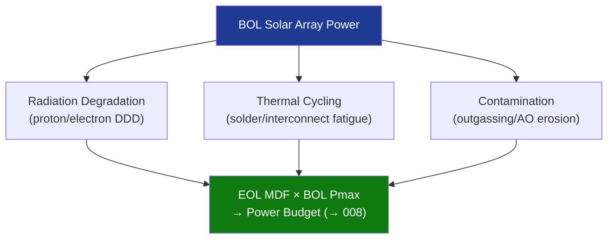

# STA 130-139 · 130-070 — Degradation Radiation and Thermal Cycling Effects

## 1. Purpose

Establishes the **degradation model requirements** for solar arrays on Q+ATLANTIDE STA-band platforms, covering radiation-induced, thermal cycling, micrometeorite, and contamination effects.

## 2. Scope

- **Radiation degradation** — proton and electron fluence equivalence (1 MeV electrons); displacement damage dose (DDD); cell Pmax degradation at EOL; worst-case shielding assumptions.
- **Thermal cycling** — BOL/EOL temperature range (−180 °C to +120 °C typical); solder joint fatigue; interconnect flex fatigue; number of thermal cycles over mission life.
- **Mean degradation factor (MDF)** — combined radiation + contamination + micrometeorite erosion factor applied to BOL Pmax in power budget.
- **Contamination effects** — outgassing deposits on coverglass (→ `111_Materiales-Espaciales`); UV darkening; periodic power output monitoring.
- **Atomic oxygen (AO)** — relevant for LEO < 700 km; surface erosion of kapton flex circuits and adhesives; AO-resistant coatings required.

## 3. Diagram — Degradation Source Hierarchy

## 4. Footprint

| Metric | Value |
|---|---|
| Subsection | `130` — Energía Solar |
| Subsubject | `007` — Degradation, Radiation and Thermal Cycling Effects |
| Primary Q-Division | Q-SPACE[^qdiv] |
| Governance class | `baseline`[^gov] |

## 5. References & Citations

[^nasahdbk4002b]: **NASA-HDBK-4002B — Mitigating In-Space Charging Effects**.
[^qdiv]: **Q-Division authority** — See [`organization/Q+ATLANTIDE.md` §4](../../../../organization/Q+ATLANTIDE.md#4-notes).
[^gov]: **Governance class** — `baseline`.

### Applicable industry standards
- ECSS-E-ST-20-08C — Photovoltaic Assemblies and Components
- NASA-HDBK-4002B — Mitigating In-Space Charging Effects[^nasahdbk4002b]
