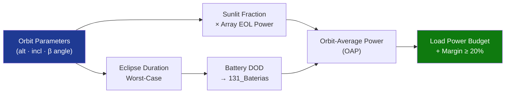

# STA 130-139 · 130-080 — Eclipse Operations and Energy Budgeting

## 1. Purpose

Establishes **eclipse duration modelling and spacecraft energy budgeting methodology** for Q+ATLANTIDE STA-band platforms.

## 2. Scope

- **Eclipse duration** — function of orbital altitude, inclination, and season; worst-case eclipse fraction (β = 0°): ≈ 35–40 min for 400 km LEO; ≈ 72 min for 800 km SSO; zero for GEO in most months.
- **Power budget methodology** — (1) orbit-average power (OAP): P_gen × duty_sun = P_load × 1; (2) EOL power margin ≥ 20% on OAP; (3) peak-power constraint: battery + array ≥ peak load.
- **Battery depth of discharge (DOD)** — LEO: maximum DOD ≤ 30% (Li-ion); GEO: maximum DOD ≤ 80%; eclipse case sizing linked to `131_Baterias-y-Almacenamiento`.
- **Safe-mode power floor** — minimum continuous load (housekeeping, thermal, comms) must be met by array + battery in worst-case eclipse attitude.
- **Seasonal variation** — Earth-Sun distance variation ±3.3%; worst-case solar flux at aphelion must be included in BOL/EOL budget.

## 3. Diagram — Energy Budget Flow

## 4. Footprint

| Metric | Value |
|---|---|
| Subsection | `130` — Energía Solar |
| Subsubject | `008` — Eclipse Operations and Energy Budgeting |
| Primary Q-Division | Q-SPACE[^qdiv] |
| Governance class | `baseline`[^gov] |

## 5. References & Citations

[^ecssest20]: **ECSS-E-ST-20C — Electrical and Electronic**.
[^qdiv]: **Q-Division authority** — See [`organization/Q+ATLANTIDE.md` §4](../../../../organization/Q+ATLANTIDE.md#4-notes).
[^gov]: **Governance class** — `baseline`.

### Applicable industry standards
- ECSS-E-ST-20C — Electrical and Electronic[^ecssest20]
