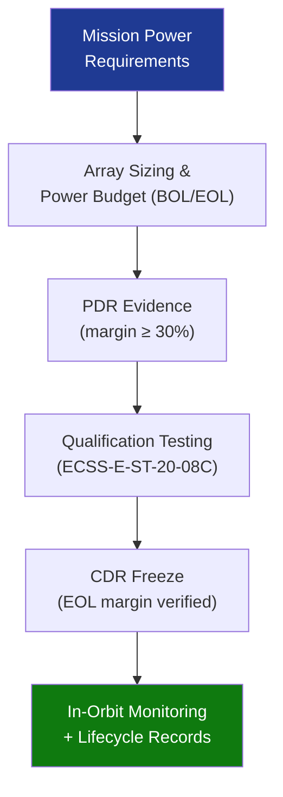

# STA 130-139 · 130-090 — Traceability Evidence and Lifecycle Governance

## 1. Purpose

Establishes **traceability, design evidence, and lifecycle governance requirements** for solar energy systems on Q+ATLANTIDE STA-band platforms.

## 2. Scope

- **Requirements traceability** — power budget (BOL/EOL), array sizing, degradation factors, and eclipse case margins traced to system-level mission requirements; managed in Q+ATLANTIDE requirements register.
- **Design evidence gates** — PDR: power budget with BOL margin ≥ 30%; CDR: EOL power budget verified with qualification test data; delta-CDR for post-CDR changes.
- **Qualification evidence** — cell qualification per ECSS-E-ST-20-08C; array-level vibration, acoustic and thermal-vacuum testing; deployment testing.
- **In-orbit monitoring** — array output current and voltage telemetry; periodic power-generation trend analysis vs. degradation model; anomaly flags.
- **Lifecycle records** — configuration item (CI) records for array serial numbers, cell lot traceability, and coverglass materials maintained through decommissioning.
- **Interface control documents (ICDs)** — SADM ICD, harness ICD, and power budget freeze at CDR+.

## 3. Diagram — Traceability and Governance Flow

## 4. Footprint

| Metric | Value |
|---|---|
| Subsection | `130` — Energía Solar |
| Subsubject | `010` — Traceability, Evidence and Lifecycle Governance |
| Primary Q-Division | Q-SPACE[^qdiv] |
| Governance class | `baseline`[^gov] |

## 5. References & Citations

[^ecssest20]: **ECSS-E-ST-20C — Electrical and Electronic**.
[^ecssest2008c]: **ECSS-E-ST-20-08C — Photovoltaic Assemblies and Components**.
[^qdiv]: **Q-Division authority** — See [`organization/Q+ATLANTIDE.md` §4](../../../../organization/Q+ATLANTIDE.md#4-notes).
[^gov]: **Governance class** — `baseline`.

### Applicable industry standards
- ECSS-E-ST-20C[^ecssest20]
- ECSS-E-ST-20-08C[^ecssest2008c]
