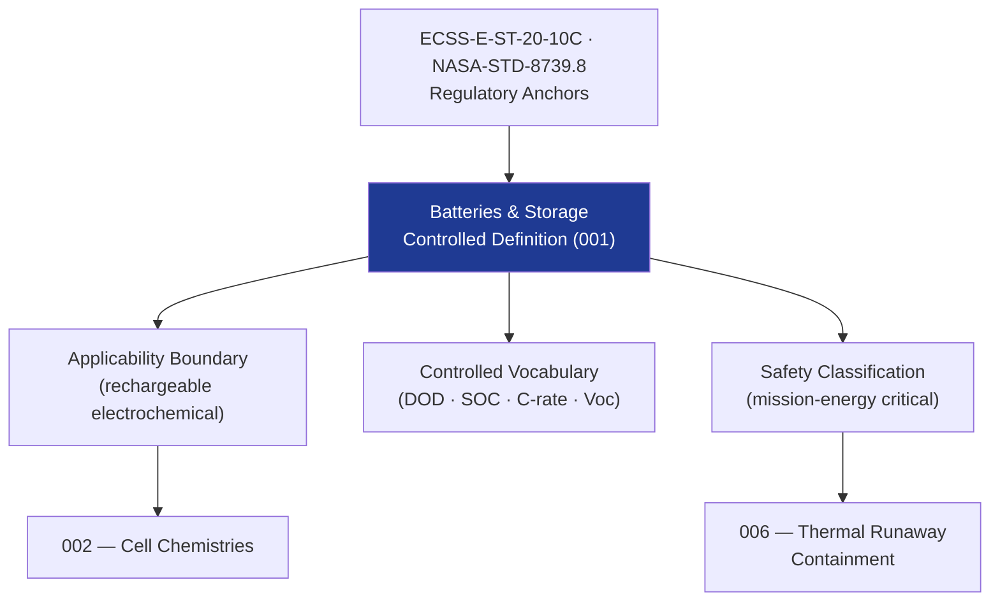

# STA 130-139 · Section 03 · Subsection 131 · Subsubject 001 — Batteries and Storage Controlled Definition

## 1. Purpose

Establishes the **normative definition and controlled scope** of batteries and energy storage within Q+ATLANTIDE STA-band platforms, per ECSS-E-ST-20-10C[^ecssest2010c].

## 2. Scope

- **Controlled definition** — Batteries and energy storage systems store electrical energy generated by primary sources (solar, nuclear) and release it on demand to power spacecraft loads during eclipse, peak-demand, and safe-mode intervals.
- **Applicability boundary** — STA `131` covers all rechargeable electrochemical storage systems; excludes primary (non-rechargeable) batteries used for pyrotechnic/separation systems; excludes capacitor energy storage (super-/ultra-capacitors only if co-managed by BMS under this subsection).
- **Controlled vocabulary** — *capacity (Ah)*, *energy (Wh)*, *depth of discharge (DOD)*, *state of charge (SOC)*, *state of health (SOH)*, *C-rate*, *open-circuit voltage (Voc)*, *internal resistance (Ri)*, *thermal runaway*.
- **Safety classification** — mission-energy critical; thermal runaway is a Criticality-1 hazard requiring containment design and evidence.

## 3. Diagram — Batteries and Storage Scope

## 4. Footprint

| Metric | Value |
|---|---|
| Subsection | `131` — Baterías y Almacenamiento |
| Subsubject | `001` — Batteries and Storage Controlled Definition |
| Primary Q-Division | Q-SPACE[^qdiv] |
| Governance class | `baseline`[^gov] |

## 5. References & Citations

[^ecssest2010c]: **ECSS-E-ST-20-10C — Space Engineering: Batteries** — European standard for spacecraft battery design, test and qualification.
[^qdiv]: **Q-Division authority** — See [`organization/Q+ATLANTIDE.md` §4](../../../../organization/Q+ATLANTIDE.md#4-notes).
[^gov]: **Governance class** — `baseline`.

### Applicable industry standards
- ECSS-E-ST-20-10C — Batteries[^ecssest2010c]
