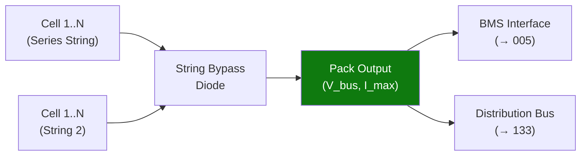

# STA 130-139 · Section 03 · Subsection 131 · Subsubject 003 — Battery Pack, Module and String Architecture

## 1. Purpose

Defines **battery pack, module and string architecture options** for Q+ATLANTIDE STA-band platforms, including series/parallel cell configurations, redundancy and bypass protection.

## 2. Scope

- **String configuration** — N cells in series to achieve required bus voltage; voltage per cell × N = pack voltage; current rating determined by cell capacity and discharge C-rate.
- **Parallel strings** — M strings in parallel for capacity/redundancy; bypass diodes prevent reverse current through failed strings.
- **Module architecture** — sub-groups of cells with local monitoring; reduces wiring harness complexity; enables module-level bypass.
- **Structural packaging** — cell stack in aluminium/CFRP enclosure; vibration isolation; thermal interface material (TIM) to radiator.
- **Redundancy** — single-fault tolerant by design (two strings minimum for Criticality-1 loads); isolation relays per string.

## 3. Diagram — Pack Architecture

## 4. Footprint

| Metric | Value |
|---|---|
| Subsection | `131` — Baterías y Almacenamiento |
| Subsubject | `003` — Battery Pack, Module and String Architecture |
| Primary Q-Division | Q-SPACE[^qdiv] |
| Governance class | `baseline`[^gov] |

## 5. References & Citations

[^ecssest2010c]: **ECSS-E-ST-20-10C — Batteries**.
[^qdiv]: **Q-Division authority** — See [`organization/Q+ATLANTIDE.md` §4](../../../../organization/Q+ATLANTIDE.md#4-notes).
[^gov]: **Governance class** — `baseline`.

### Applicable industry standards
- ECSS-E-ST-20-10C — Batteries[^ecssest2010c]
