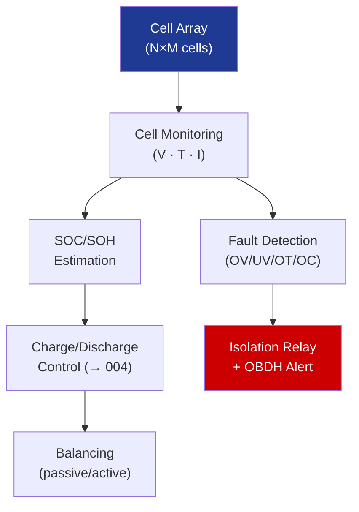

# STA 130-139 · Section 03 · Subsection 131 · Subsubject 005 — Battery Management System (BMS)

## 1. Purpose

Defines the **Battery Management System (BMS)** functions, interfaces, and failure detection requirements for Q+ATLANTIDE STA-band platforms.

## 2. Scope

- **Cell monitoring** — voltage per cell (±1 mV resolution); temperature per cell or module (±1°C); current (±10 mA); data rate ≥ 1 Hz.
- **Cell balancing** — passive (resistive bleed) or active (charge shuttling); balance threshold ≤ 10 mV cell-to-cell imbalance.
- **Isolation and protection** — main contactor relay (ground and flight isolation); pre-charge circuit for capacitive loads; pyrofuse for irreversible short-circuit protection.
- **Fault detection** — over-voltage, under-voltage, over-temperature, over-current, cell imbalance; fault flags to OBDH for autonomous safe-mode.
- **Telemetry interface** — BMS → OBDH via SpaceWire, CAN, or RS-422; SOC/SOH reporting; anomaly logging.

## 3. Diagram — BMS Functional Architecture

## 4. Footprint

| Metric | Value |
|---|---|
| Subsection | `131` — Baterías y Almacenamiento |
| Subsubject | `005` — Battery Management System (BMS) |
| Primary Q-Division | Q-SPACE[^qdiv] |
| Governance class | `baseline`[^gov] |

## 5. References & Citations

[^ecssest2010c]: **ECSS-E-ST-20-10C — Batteries**.
[^qdiv]: **Q-Division authority** — See [`organization/Q+ATLANTIDE.md` §4](../../../../organization/Q+ATLANTIDE.md#4-notes).
[^gov]: **Governance class** — `baseline`.

### Applicable industry standards
- ECSS-E-ST-20-10C — Batteries[^ecssest2010c]
- ECSS-E-ST-70-41C — Telemetry and Telecommand Packet Utilization
