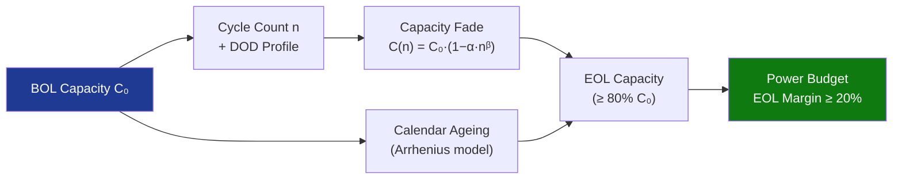

# STA 130-139 · Section 03 · Subsection 131 · Subsubject 007 — Degradation, Cycling and Lifetime Modelling

## 1. Purpose

Establishes **battery degradation modelling requirements** for Q+ATLANTIDE STA-band platforms, covering capacity fade, impedance growth, and EOL capacity margins.

## 2. Scope

- **Capacity fade model** — empirical Ah-throughput model; capacity retention C(n) = C₀ × (1 − α·n^β); parameters derived from qualification test data; EOL capacity ≥ 80% BOL.
- **Impedance growth** — internal resistance Ri increases with cycling; higher Ri reduces available energy and increases thermal dissipation; modelled for worst-case EOL discharge scenario.
- **Calendar ageing** — storage at elevated temperature accelerates capacity fade even without cycling; Arrhenius-based model for storage intervals.
- **DOD effect** — deeper DOD accelerates capacity fade; Rainflow cycle counting methodology for variable DOD profiles.
- **Margin requirement** — EOL power budget must include capacity fade margin; sizing margin ≥ 20% over mission life.

## 3. Diagram — Degradation Model

## 4. Footprint

| Metric | Value |
|---|---|
| Subsection | `131` — Baterías y Almacenamiento |
| Subsubject | `007` — Degradation, Cycling and Lifetime Modelling |
| Primary Q-Division | Q-SPACE[^qdiv] |
| Governance class | `baseline`[^gov] |

## 5. References & Citations

[^ecssest2010c]: **ECSS-E-ST-20-10C — Batteries**.
[^qdiv]: **Q-Division authority** — See [`organization/Q+ATLANTIDE.md` §4](../../../../organization/Q+ATLANTIDE.md#4-notes).
[^gov]: **Governance class** — `baseline`.

### Applicable industry standards
- ECSS-E-ST-20-10C — Batteries[^ecssest2010c]
