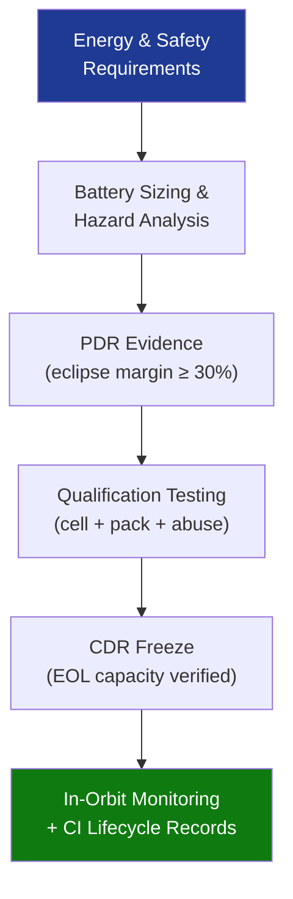

# STA 130-139 · Section 03 · Subsection 131 · Subsubject 010 — Traceability, Evidence and Lifecycle Governance

## 1. Purpose

Establishes **traceability, design evidence, and lifecycle governance** for batteries and energy storage systems on Q+ATLANTIDE STA-band platforms.

## 2. Scope

- **Requirements traceability** — battery capacity, DOD limits, cycle life, EOL margin, thermal runaway containment traced to system-level energy and safety requirements.
- **Design evidence gates** — PDR: eclipse energy budget with ≥ 30% margin; CDR: EOL capacity budget with qualification test data; pack-level freeze.
- **Qualification evidence** — cell and pack test reports per ECSS-E-ST-20-10C; abuse test reports; containment evidence.
- **In-orbit monitoring** — SOC/SOH trend from telemetry; capacity fade vs. model; anomaly flagging; periodic ground analysis.
- **Hazard traceability** — thermal runaway HA closure evidence linked to qualification test reports; updated at delta-CDR.
- **CI records** — cell lot traceability, BMS firmware version, pack serial numbers; maintained through decommissioning.

## 3. Diagram — Traceability Flow

## 4. Footprint

| Metric | Value |
|---|---|
| Subsection | `131` — Baterías y Almacenamiento |
| Subsubject | `010` — Traceability, Evidence and Lifecycle Governance |
| Primary Q-Division | Q-SPACE[^qdiv] |
| Governance class | `baseline`[^gov] |

## 5. References & Citations

[^ecssest2010c]: **ECSS-E-ST-20-10C — Batteries**.
[^qdiv]: **Q-Division authority** — See [`organization/Q+ATLANTIDE.md` §4](../../../../organization/Q+ATLANTIDE.md#4-notes).
[^gov]: **Governance class** — `baseline`.

### Applicable industry standards
- ECSS-E-ST-20-10C — Batteries[^ecssest2010c]
