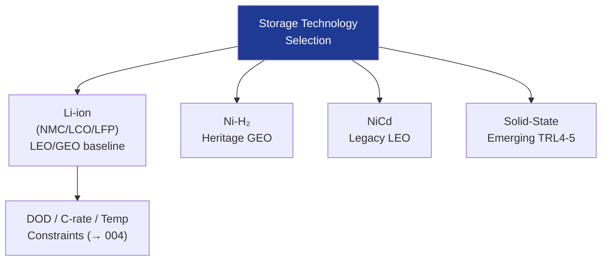

# STA 130-139 · 131-020 — Cell Chemistries and Storage Technology Families

## 1. Purpose

Establishes the **taxonomy of electrochemical cell chemistries and storage technology families** applicable to Q+ATLANTIDE STA-band space platforms.

## 2. Scope

- **Lithium-ion (Li-ion)** — NMC, LCO, LFP cathodes; graphite anode; specific energy 150–250 Wh/kg; dominant for LEO/GEO spacecraft; DOD limit ≤ 30% LEO, ≤ 80% GEO.
- **Lithium-polymer (Li-Po)** — similar chemistry to Li-ion; flexible pouch cell; lower specific energy but lighter packaging.
- **Nickel-Hydrogen (Ni-H₂)** — heritage GEO technology; high cycle life (>30,000 cycles); lower specific energy (50–60 Wh/kg); phased out for new designs but still in legacy systems.
- **Nickel-Cadmium (NiCd)** — legacy LEO; low specific energy; superseded by Li-ion in most applications.
- **Solid-state (emerging)** — ceramic/polymer electrolyte; improved safety; TRL 4–5 for space; no established qualification standard.
- **Selection criteria** — specific energy, cycle life, operational temperature range, radiation tolerance, TRL, and safety risk.

## 3. Diagram — Cell Chemistry Taxonomy

## 4. Footprint

| Metric | Value |
|---|---|
| Subsection | `131` — Baterías y Almacenamiento |
| Subsubject | `002` — Cell Chemistries and Storage Technology Families |
| Primary Q-Division | Q-SPACE[^qdiv] |
| Governance class | `baseline`[^gov] |

## 5. References & Citations

[^ecssest2010c]: **ECSS-E-ST-20-10C — Batteries**.
[^qdiv]: **Q-Division authority** — See [`organization/Q+ATLANTIDE.md` §4](../../../../organization/Q+ATLANTIDE.md#4-notes).
[^gov]: **Governance class** — `baseline`.

### Applicable industry standards
- ECSS-E-ST-20-10C — Batteries[^ecssest2010c]
