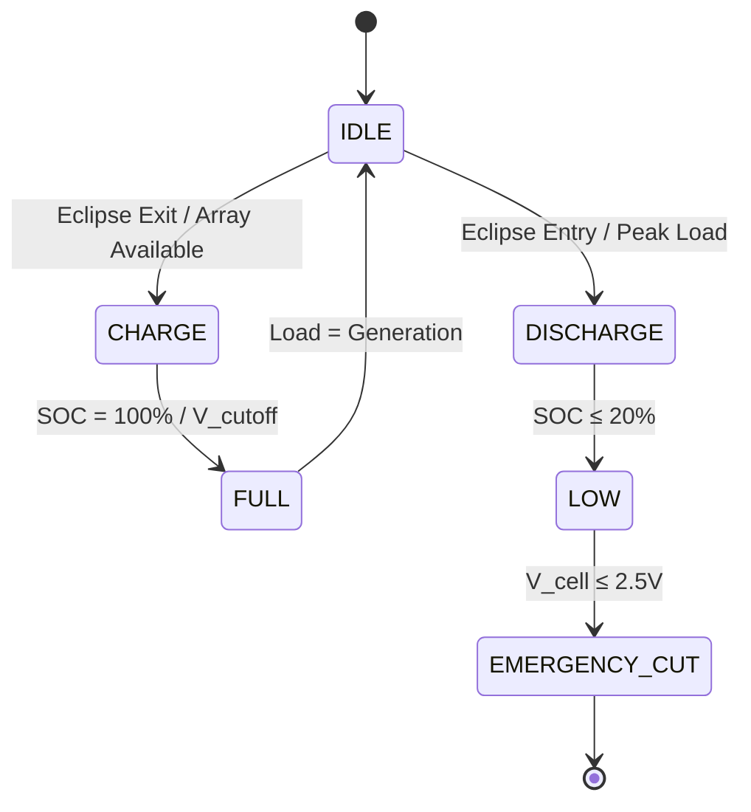

# STA 130-139 · 131-040 — Charge Discharge and State Control

## 1. Purpose

Defines **charge and discharge control algorithms and state management** for batteries on Q+ATLANTIDE STA-band platforms.

## 2. Scope

- **Charge algorithms** — constant current / constant voltage (CC/CV); trickle charge for storage; temperature-compensated voltage limits; charge termination by dV/dt or timer.
- **Discharge control** — max C-rate limits (Li-ion: typically ≤ 2C continuous); over-discharge protection; voltage cutoff per cell ≥ 2.5 V (Li-ion); hard cutoff relay isolation.
- **State-of-charge (SOC) estimation** — coulomb counting (Ah integration) + OCV model; Kalman filter for improved accuracy; calibration at full-charge reference.
- **State-of-health (SOH)** — capacity fade tracking vs. BOL; impedance rise; flagging for capacity margin reassessment.
- **Operational modes** — nominal charge (eclipse exit), trickle charge (GEO long sunlit), safe-mode deep-discharge recovery, storage mode (ground).

## 3. Diagram — Charge/Discharge State Machine

## 4. Footprint

| Metric | Value |
|---|---|
| Subsection | `131` — Baterías y Almacenamiento |
| Subsubject | `004` — Charge-Discharge and State Control |
| Primary Q-Division | Q-SPACE[^qdiv] |
| Governance class | `baseline`[^gov] |

## 5. References & Citations

[^ecssest2010c]: **ECSS-E-ST-20-10C — Batteries**.
[^qdiv]: **Q-Division authority** — See [`organization/Q+ATLANTIDE.md` §4](../../../../organization/Q+ATLANTIDE.md#4-notes).
[^gov]: **Governance class** — `baseline`.

### Applicable industry standards
- ECSS-E-ST-20-10C — Batteries[^ecssest2010c]
