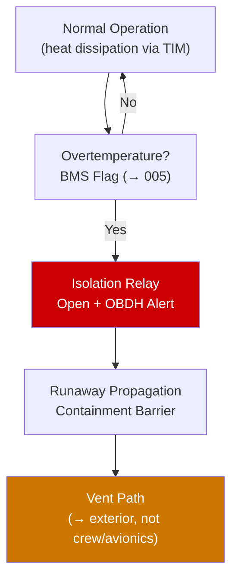

# STA 130-139 · 131-060 — Thermal Management and Runaway Containment

## 1. Purpose

Establishes **thermal management requirements and thermal runaway containment design** for batteries on Q+ATLANTIDE STA-band platforms. Thermal runaway is classified as a Criticality-1 hazard.

## 2. Scope

- **Operating temperature range** — Li-ion charge: 0°C to +45°C; discharge: −20°C to +60°C; survival: −40°C to +70°C.
- **Heat generation** — Joule heating: Q = I²·Ri; exothermal at high SOC or overcharge; thermal model required for all charge/discharge scenarios.
- **Thermal interface** — battery pack baseplate to spacecraft structural radiator via TIM (thermal conductance ≥ 0.5 W/cm²·K); heater mats for cold survival.
- **Thermal runaway containment** — cell-to-cell propagation barriers (mica sheets, ceramic separators); vent path to spacecraft exterior (not toward crew/avionics); venting analysis per NASA-STD-6016B[^nasastd6016b].
- **Detection and response** — BMS over-temperature flag (→ `005`) + autonomous isolation within 100 ms; OBDH safe-mode transition.

## 3. Diagram — Thermal Management and Runaway Response

## 4. Footprint

| Metric | Value |
|---|---|
| Subsection | `131` — Baterías y Almacenamiento |
| Subsubject | `006` — Thermal Management and Runaway Containment |
| Primary Q-Division | Q-SPACE[^qdiv] |
| Governance class | `baseline`[^gov] |

## 5. References & Citations

[^ecssest2010c]: **ECSS-E-ST-20-10C — Batteries**.
[^nasastd6016b]: **NASA-STD-6016B — Standard Materials and Processes Requirements for Spacecraft**.
[^qdiv]: **Q-Division authority** — See [`organization/Q+ATLANTIDE.md` §4](../../../../organization/Q+ATLANTIDE.md#4-notes).
[^gov]: **Governance class** — `baseline`.

### Applicable industry standards
- ECSS-E-ST-20-10C — Batteries[^ecssest2010c]
- NASA-STD-6016B — Standard Materials and Processes Requirements for Spacecraft[^nasastd6016b]
