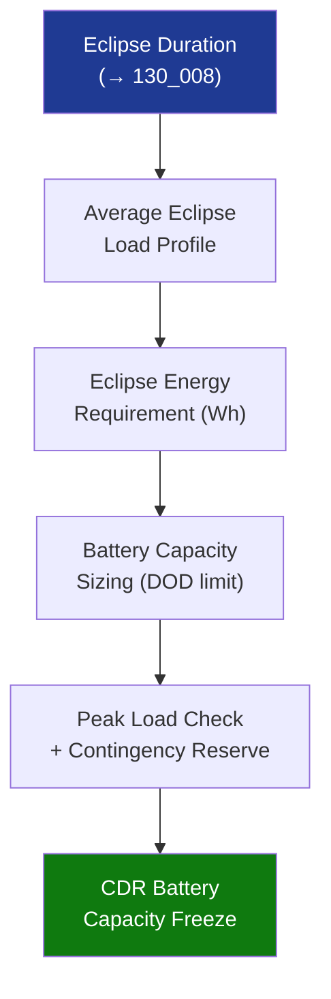

# STA 130-139 · 131-080 — Eclipse Peak Load and Contingency Energy Budgeting

## 1. Purpose

Establishes **energy budgeting methodology** for eclipse, peak-load, and contingency intervals for Q+ATLANTIDE STA-band platform batteries.

## 2. Scope

- **Eclipse energy sizing** — E_eclipse = P_load_avg × t_eclipse; battery capacity = E_eclipse / (DOD_limit × η_discharge); DOD_limit: 30% (LEO Li-ion), 80% (GEO Li-ion).
- **Peak-load provision** — transient peak power (actuator start, TM transmit) supplied from battery + array; peak duration constraint (< 5 s for capacitive peak); BMS current limit verified.
- **Contingency reserve** — 10–20% energy reserve above nominal eclipse case for FDIR recovery modes and extended eclipse (stuck SADM, off-pointing).
- **Safe-mode floor** — minimum 72 h safe-mode autonomy from battery alone (for crewed platforms: minimum 24 h from battery alone if arrays are partially occulted).
- **Sizing iteration** — eclipse energy sizing ↔ array sizing ↔ power budget (→ `130_008`) jointly iterated at PDR/CDR.

## 3. Diagram — Energy Budget Sizing Flow

## 4. Footprint

| Metric | Value |
|---|---|
| Subsection | `131` — Baterías y Almacenamiento |
| Subsubject | `008` — Eclipse, Peak-Load and Contingency Energy Budgeting |
| Primary Q-Division | Q-SPACE[^qdiv] |
| Governance class | `baseline`[^gov] |

## 5. References & Citations

[^ecssest2010c]: **ECSS-E-ST-20-10C — Batteries**.
[^qdiv]: **Q-Division authority** — See [`organization/Q+ATLANTIDE.md` §4](../../../../organization/Q+ATLANTIDE.md#4-notes).
[^gov]: **Governance class** — `baseline`.

### Applicable industry standards
- ECSS-E-ST-20-10C — Batteries[^ecssest2010c]
- ECSS-E-ST-20C — Electrical and Electronic
