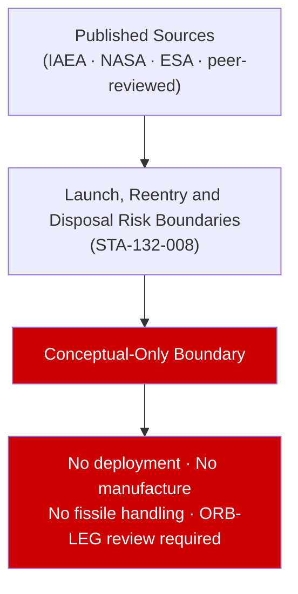

# STA 130-139 · Section 03 · Subsection 132 · Subsubject 008 — Launch, Reentry and Disposal Risk Boundaries

## 1. Purpose

Defines **launch, reentry and disposal risk conceptual boundaries** for space nuclear power systems. Launch safety governed by INSRP process (NASA/DOE/DoD); reentry dispersal analysis required per NASA-STD-8719.14B; disposal orbit requirements per IAEA Safety Series No. 6 (highly eccentric or high-altitude storage orbits). Q+ATLANTIDE STA-132 documents these boundaries conceptually; no operational risk analysis is within scope without separate authority.

## 2. Scope

- **Conceptual boundary applies** — this subsubject is designated conceptual-only per subsection README.md. All content is based on published, publicly available sources. No design, manufacture, deployment, fissile-material handling, or reactor operation is within scope.
- All nuclear energy performance claims cite published mission or technology assessment sources.

## 3. Diagram — Conceptual Overview

## 4. Footprint

| Metric | Value |
|---|---|
| Subsection | `132` — Energía Nuclear Espacial Conceptual |
| Subsubject | `008` — Launch, Reentry and Disposal Risk Boundaries |
| Primary Q-Division | Q-SPACE[^qdiv] |
| Safety boundary | **conceptual-only** |
| Governance class | `baseline`[^gov] |

## 5. References & Citations

[^iaeass6]: **IAEA Safety Series No. 6** — Principles Relevant to the Use of Nuclear Power Sources in Outer Space.
[^qdiv]: **Q-Division authority** — See [`organization/Q+ATLANTIDE.md` §4](../../../../organization/Q+ATLANTIDE.md#4-notes).
[^gov]: **Governance class** — `baseline`.

### Applicable industry standards
- IAEA Safety Series No. 6[^iaeass6]
- Outer Space Treaty (1967) — Article IV
