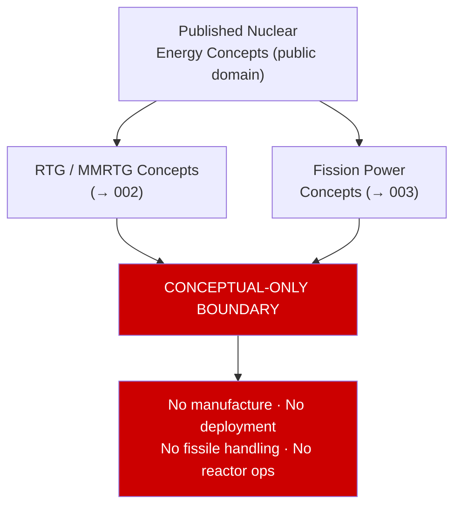

# STA 130-139 · 132-010 — Space Nuclear Energy Conceptual Definition

## 1. Purpose

Establishes the **normative conceptual-only definition and scope boundary** for space nuclear energy within Q+ATLANTIDE STA-band documentation.

## 2. Scope

- **Controlled definition** — Space nuclear energy concepts encompass radioisotope decay heat and fission chain-reaction systems that generate electrical power for spacecraft and surface platforms. Within Q+ATLANTIDE, this subsection is **conceptual-only**: it surveys published, publicly available mission and technology concepts for architecture awareness and mission-class screening purposes only.
- **Applicability boundary** — No design, manufacture, deployment, launch integration, fissile-material handling, reactor operation, criticality analysis, weapons-related application, or weaponizable technical detail is within scope. Refer to `007` for the full regulatory constraint boundary.
- **Controlled vocabulary** — *radioisotope thermoelectric generator (RTG)*, *multi-mission RTG (MMRTG)*, *fission surface power (FSP)*, *nuclear electric power (NEP)*, *thermal power (W_th)*, *electrical power (W_e)*, *conversion efficiency (η = W_e/W_th)*.
- **claim_discipline** — all nuclear energy performance claims must cite published, peer-reviewed mission or technology sources; no speculative power levels or fuel masses without citation.

## 3. Diagram — Conceptual Boundary

## 4. Footprint

| Metric | Value |
|---|---|
| Subsection | `132` — Energía Nuclear Espacial Conceptual |
| Subsubject | `001` — Space Nuclear Energy Conceptual Definition |
| Primary Q-Division | Q-SPACE[^qdiv] |
| Safety boundary | **conceptual-only** |
| Governance class | `baseline`[^gov] |

## 5. References & Citations

[^iaeass6]: **IAEA Safety Series No. 6** — Principles Relevant to the Use of Nuclear Power Sources in Outer Space.
[^qdiv]: **Q-Division authority** — See [`organization/Q+ATLANTIDE.md` §4](../../../../organization/Q+ATLANTIDE.md#4-notes).
[^gov]: **Governance class** — `baseline`.

### Applicable industry standards
- IAEA Safety Series No. 6[^iaeass6]
- Outer Space Treaty (1967) — Article IV: nuclear weapons and other WMD exclusion
