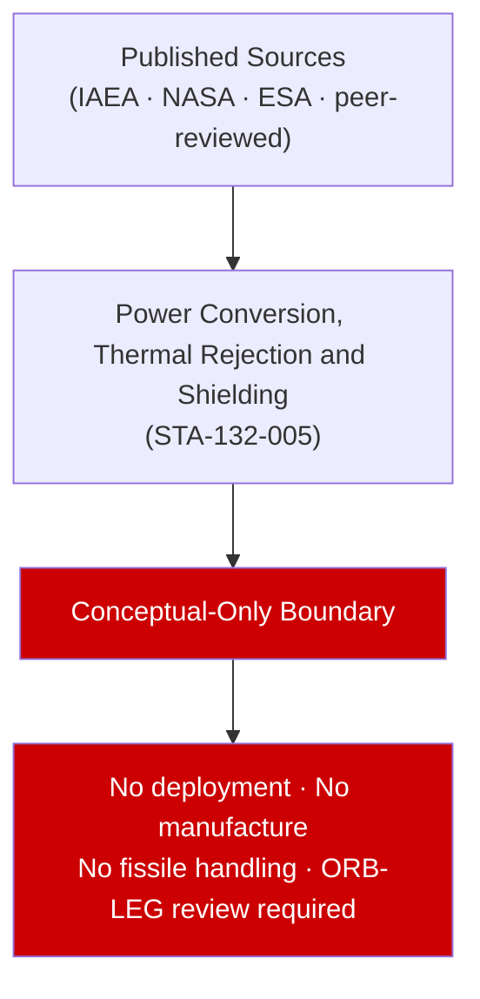

# STA 130-139 · 132-050 — Power Conversion Thermal Rejection and Shielding

## 1. Purpose

Surveys **published power conversion and thermal rejection concepts** for space nuclear systems: thermoelectric (Seebeck effect, η ≈ 5–8%), Stirling (η ≈ 20–30%), Brayton (η ≈ 20–35%). Shadow-shield geometry for crew/electronics protection. All concepts cited from published mission and technology assessment sources.

## 2. Scope

- **Conceptual boundary applies** — this subsubject is designated conceptual-only per subsection README.md. All content is based on published, publicly available sources. No design, manufacture, deployment, fissile-material handling, or reactor operation is within scope.
- All nuclear energy performance claims cite published mission or technology assessment sources.

## 3. Diagram — Conceptual Overview

## 4. Footprint

| Metric | Value |
|---|---|
| Subsection | `132` — Energía Nuclear Espacial Conceptual |
| Subsubject | `005` — Power Conversion, Thermal Rejection and Shielding |
| Primary Q-Division | Q-SPACE[^qdiv] |
| Safety boundary | **conceptual-only** |
| Governance class | `baseline`[^gov] |

## 5. References & Citations

[^iaeass6]: **IAEA Safety Series No. 6** — Principles Relevant to the Use of Nuclear Power Sources in Outer Space.
[^qdiv]: **Q-Division authority** — See [`organization/Q+ATLANTIDE.md` §4](../../../../organization/Q+ATLANTIDE.md#4-notes).
[^gov]: **Governance class** — `baseline`.

### Applicable industry standards
- IAEA Safety Series No. 6[^iaeass6]
- Outer Space Treaty (1967) — Article IV
