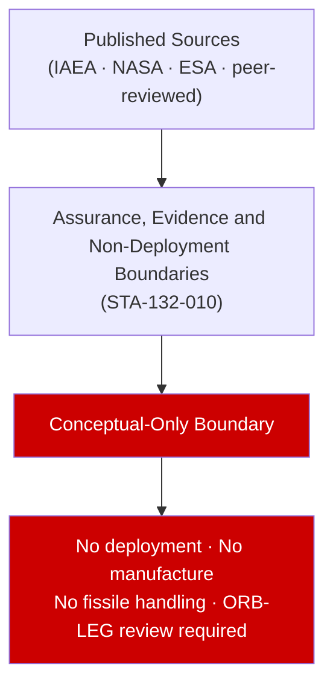

# STA 130-139 · 132-090 — Assurance Evidence and Non Deployment Boundaries

## 1. Purpose

Establishes **assurance evidence and non-deployment boundary** requirements for STA-132 documentation. The conceptual-only boundary requires: (1) all claims cite published, peer-reviewed or government-published sources; (2) no proprietary fuel/reactor design data entered into this documentation without separate governance authority; (3) any future transition beyond conceptual screening requires a separate Q+ATLANTIDE governance decision record (GDR) and lawful authority document; (4) ORB-LEG review mandatory before any STA-132 subsubject upgrade from 'conceptual' to 'design' status.

## 2. Scope

- **Conceptual boundary applies** — this subsubject is designated conceptual-only per subsection README.md. All content is based on published, publicly available sources. No design, manufacture, deployment, fissile-material handling, or reactor operation is within scope.
- All nuclear energy performance claims cite published mission or technology assessment sources.

## 3. Diagram — Conceptual Overview

## 4. Footprint

| Metric | Value |
|---|---|
| Subsection | `132` — Energía Nuclear Espacial Conceptual |
| Subsubject | `010` — Assurance, Evidence and Non-Deployment Boundaries |
| Primary Q-Division | Q-SPACE[^qdiv] |
| Safety boundary | **conceptual-only** |
| Governance class | `baseline`[^gov] |

## 5. References & Citations

[^iaeass6]: **IAEA Safety Series No. 6** — Principles Relevant to the Use of Nuclear Power Sources in Outer Space.
[^qdiv]: **Q-Division authority** — See [`organization/Q+ATLANTIDE.md` §4](../../../../organization/Q+ATLANTIDE.md#4-notes).
[^gov]: **Governance class** — `baseline`.

### Applicable industry standards
- IAEA Safety Series No. 6[^iaeass6]
- Outer Space Treaty (1967) — Article IV
