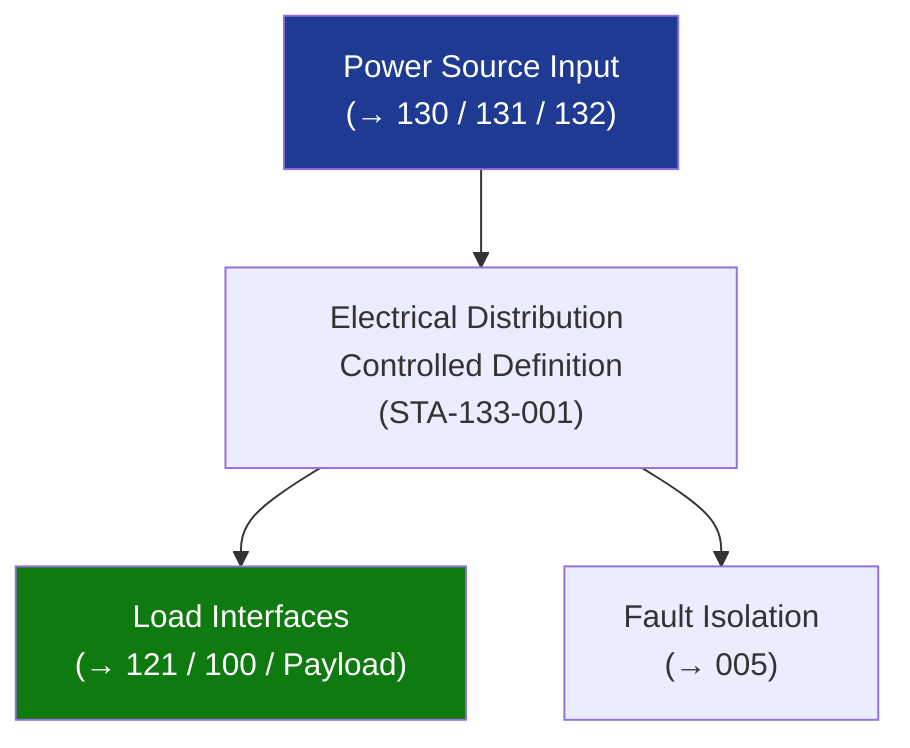

# STA 130-139 · Section 03 · Subsection 133 · Subsubject 001 — Electrical Distribution Controlled Definition

## 1. Purpose

Establishes the **normative definition and controlled scope** of electrical distribution within Q+ATLANTIDE STA-band platforms.

## 2. Scope

- **Controlled definition** — Electrical distribution systems transfer and regulate electrical power from primary sources (solar, battery, nuclear) to all spacecraft loads via a controlled bus topology, including power conditioning, protection, harness routing, and load management.
- **Applicability boundary** — STA `133` covers all power distribution from the primary bus output to load terminals; excludes power generation (→ `130`, `131`, `132`) and propulsion power processing units (→ `121`).
- **Controlled vocabulary** — *regulated bus*, *unregulated bus*, *remote power controller (RPC)*, *latching current limiter (LCL)*, *inrush current*, *voltage ripple*, *conducted emission*, *single-point ground (SPG)*, *return current*.
- **Safety classification** — mission-power critical; distribution fault isolation must prevent single-point failures from propagating to safety-critical loads.

## 3. Diagram — Electrical Distribution Controlled Definition

## 4. Footprint

| Metric | Value |
|---|---|
| Subsection | `133` — Distribución Eléctrica |
| Subsubject | `001` — Electrical Distribution Controlled Definition |
| Primary Q-Division | Q-SPACE[^qdiv] |
| Governance class | `baseline`[^gov] |

## 5. References & Citations

[^ecssest20]: **ECSS-E-ST-20C — Electrical and Electronic**.
[^qdiv]: **Q-Division authority** — See [`organization/Q+ATLANTIDE.md` §4](../../../../organization/Q+ATLANTIDE.md#4-notes).
[^gov]: **Governance class** — `baseline`.

### Applicable industry standards
- ECSS-E-ST-20C — Electrical and Electronic
