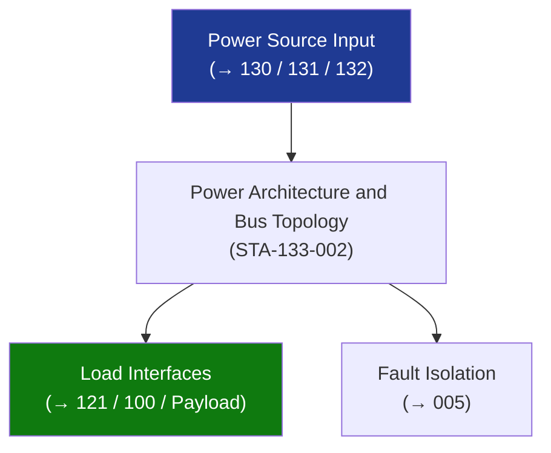

# STA 130-139 · Section 03 · Subsection 133 · Subsubject 002 — Power Architecture and Bus Topology

## 1. Purpose

Defines **power bus architecture and topology options** for Q+ATLANTIDE STA-band platforms.

## 2. Scope

- **Regulated bus** — constant voltage (28 V ± 2%, 50 V ± 2%, 100 V ± 2%); S3R or MPPT-based regulation; low-noise; preferred for sensitive payloads.
- **Unregulated bus** — battery-dominated bus; voltage varies with battery SOC (typically 24–34 V for Li-ion 28 V nominal); lower mass; used on heritage small-sat.
- **Dual bus architecture** — redundant A/B buses with cross-strapping relays; essential bus + non-essential bus; shedding hierarchy in safe-mode.
- **Voltage standards** — 28 V (small/medium platforms), 50 V (medium/large), 100 V (large LEO), 120/160 V (ISS-class/HEO large).
- **Bus capacitor sizing** — holdup time during bus fault < 1 ms; inrush limiting for capacitive loads.

## 3. Diagram — Power Architecture and Bus Topology

## 4. Footprint

| Metric | Value |
|---|---|
| Subsection | `133` — Distribución Eléctrica |
| Subsubject | `002` — Power Architecture and Bus Topology |
| Primary Q-Division | Q-SPACE[^qdiv] |
| Governance class | `baseline`[^gov] |

## 5. References & Citations

[^ecssest20]: **ECSS-E-ST-20C — Electrical and Electronic**.
[^qdiv]: **Q-Division authority** — See [`organization/Q+ATLANTIDE.md` §4](../../../../organization/Q+ATLANTIDE.md#4-notes).
[^gov]: **Governance class** — `baseline`.

### Applicable industry standards
- ECSS-E-ST-20C — Electrical and Electronic
