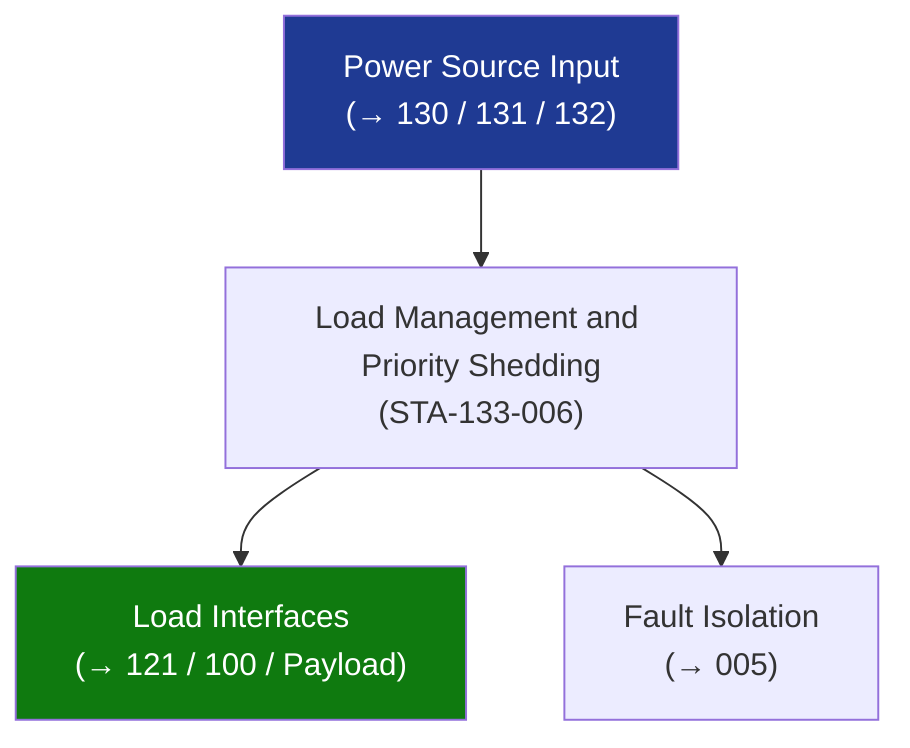

# STA 130-139 · Section 03 · Subsection 133 · Subsubject 006 — Load Management and Priority Shedding

## 1. Purpose

Establishes **load management and priority load-shedding** requirements for Q+ATLANTIDE STA-band platforms.

## 2. Scope

- **Load priority tiers** — Tier 1 (safety-critical): OBDH, attitude control actuators, crew safety systems (→ `103_Seguridad-de-Mision`), minimum thermal; Tier 2 (mission-critical): primary payload, comms; Tier 3 (non-essential): auxiliary payload, logging, non-critical heating.
- **Automatic load shedding** — triggered by bus undervoltage threshold (V_bus < 90% nominal); shed Tier 3 first, then Tier 2 if V_bus < 85%; preserve Tier 1 always.
- **Telecommand load shedding** — ground-commanded shedding for planned orbit maintenance or contingency.
- **Safe-mode power floor** — Tier 1 loads must be powered continuously from battery during safe-mode, worst-case eclipse, for minimum 72 h (crewed) / 24 h (robotic).
- **Load model** — detailed load current profile (on/off timeline, transient peaks) required in power budget at PDR/CDR.

## 3. Diagram — Load Management and Priority Shedding

## 4. Footprint

| Metric | Value |
|---|---|
| Subsection | `133` — Distribución Eléctrica |
| Subsubject | `006` — Load Management and Priority Shedding |
| Primary Q-Division | Q-SPACE[^qdiv] |
| Governance class | `baseline`[^gov] |

## 5. References & Citations

[^ecssest20]: **ECSS-E-ST-20C — Electrical and Electronic**.
[^qdiv]: **Q-Division authority** — See [`organization/Q+ATLANTIDE.md` §4](../../../../organization/Q+ATLANTIDE.md#4-notes).
[^gov]: **Governance class** — `baseline`.

### Applicable industry standards
- ECSS-E-ST-20C — Electrical and Electronic
