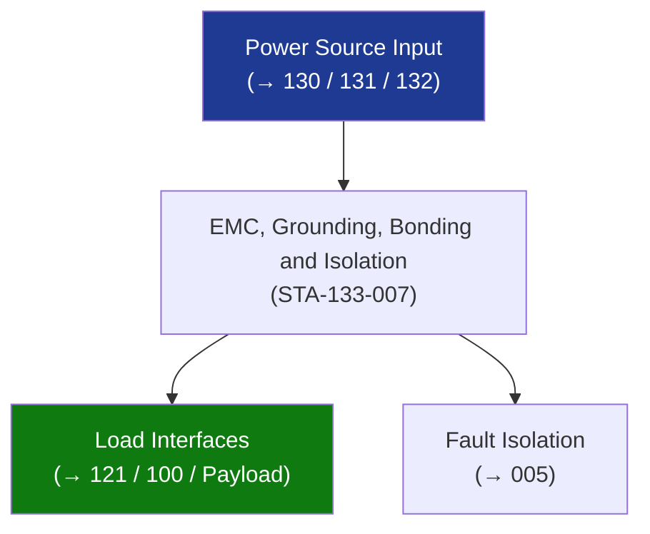

# STA 130-139 · Section 03 · Subsection 133 · Subsubject 007 — EMC, Grounding, Bonding and Isolation

## 1. Purpose

Defines **EMC, grounding, bonding, and isolation architecture** requirements for Q+ATLANTIDE STA-band platforms.

## 2. Scope

- **Single-point ground (SPG)** — all chassis returns joined at one spacecraft structure reference node; prevents ground loops; DC common-mode noise < 50 mV.
- **Chassis bonding** — all structure-mounted units bonded with resistance ≤ 2.5 mΩ per ECSS-E-ST-20-07C; bond straps with cross-sectional area ≥ signal return wire area.
- **Isolation** — primary bus isolated from chassis by ≥ 1 MΩ; verified by isolation test; floating bus prevents galvanic corrosion on orbit.
- **Conducted emission (CE)** — per MIL-STD-461G CE101 (AC) / CE102 (DC); measured at power input ports of each unit.
- **Conducted susceptibility (CS)** — per MIL-STD-461G CS101/CS114; all units must pass bus ripple/surge injection.
- **Radiated emission (RE)** — per MIL-STD-461G RE102; cable shielding and chassis slot gasketing.

## 3. Diagram — EMC, Grounding, Bonding and Isolation

## 4. Footprint

| Metric | Value |
|---|---|
| Subsection | `133` — Distribución Eléctrica |
| Subsubject | `007` — EMC, Grounding, Bonding and Isolation |
| Primary Q-Division | Q-SPACE[^qdiv] |
| Governance class | `baseline`[^gov] |

## 5. References & Citations

[^ecssest20]: **ECSS-E-ST-20C — Electrical and Electronic**.
[^qdiv]: **Q-Division authority** — See [`organization/Q+ATLANTIDE.md` §4](../../../../organization/Q+ATLANTIDE.md#4-notes).
[^gov]: **Governance class** — `baseline`.

### Applicable industry standards
- ECSS-E-ST-20C; MIL-STD-461G; ECSS-E-ST-20-07C
