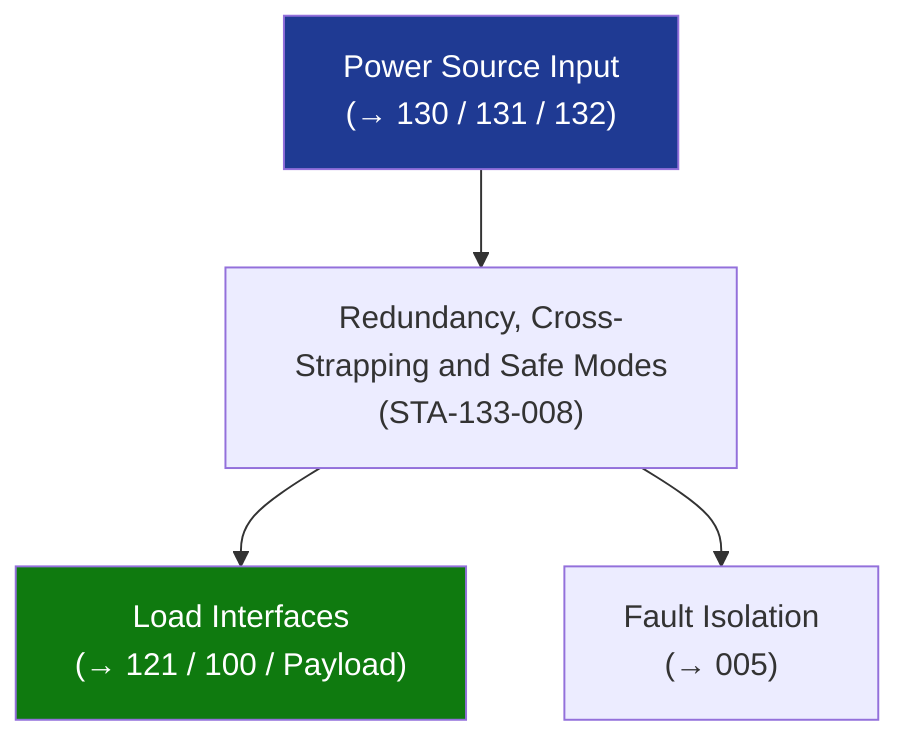

# STA 130-139 · Section 03 · Subsection 133 · Subsubject 008 — Redundancy, Cross-Strapping and Safe Modes

## 1. Purpose

Establishes **redundancy, bus cross-strapping, and safe-mode power architecture** for Q+ATLANTIDE STA-band platforms.

## 2. Scope

- **Dual-bus architecture** — Bus A and Bus B; fully independent in normal ops; cross-strap relays allow either bus to power safety-critical loads.
- **Cross-strapping logic** — automatic cross-strap on Bus A undervoltage (V < 85%) or commanded; cross-strap not latching; reverts on bus recovery.
- **Safe-mode minimum set** — defined set of loads powered on Bus A or B regardless of fault; includes OBDH, attitude sensors, basic telecommand receiver, heaters, minimal EPS monitoring.
- **Battery autonomy** — safe-mode minimum set must be sustained by battery alone for ≥ 72 h (crewed platform) / ≥ 24 h (robotic) from worst-case eclipse DOD.
- **Failure mode analysis** — FMEA/FMECA for all distribution units; single-point failures that could lead to mission loss or safety event shall be eliminated.

## 3. Diagram — Redundancy, Cross-Strapping and Safe Modes

## 4. Footprint

| Metric | Value |
|---|---|
| Subsection | `133` — Distribución Eléctrica |
| Subsubject | `008` — Redundancy, Cross-Strapping and Safe Modes |
| Primary Q-Division | Q-SPACE[^qdiv] |
| Governance class | `baseline`[^gov] |

## 5. References & Citations

[^ecssest20]: **ECSS-E-ST-20C — Electrical and Electronic**.
[^qdiv]: **Q-Division authority** — See [`organization/Q+ATLANTIDE.md` §4](../../../../organization/Q+ATLANTIDE.md#4-notes).
[^gov]: **Governance class** — `baseline`.

### Applicable industry standards
- ECSS-E-ST-20C — Electrical and Electronic; ECSS-Q-ST-30-02C — FMEA/FMECA
